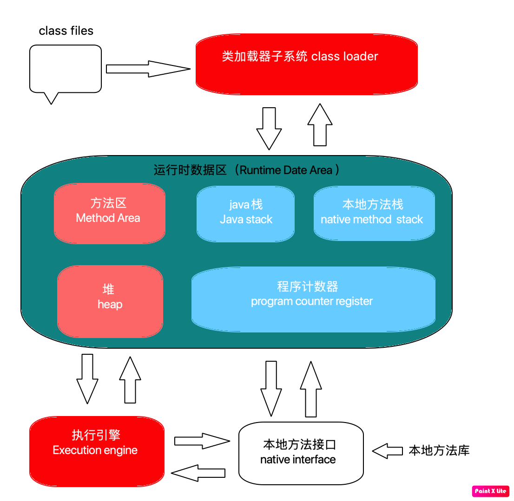
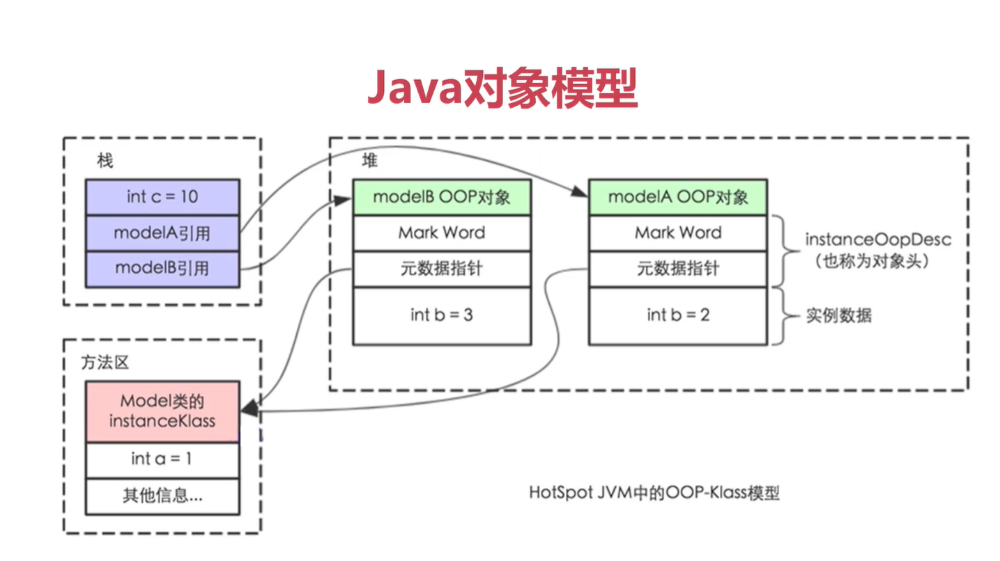
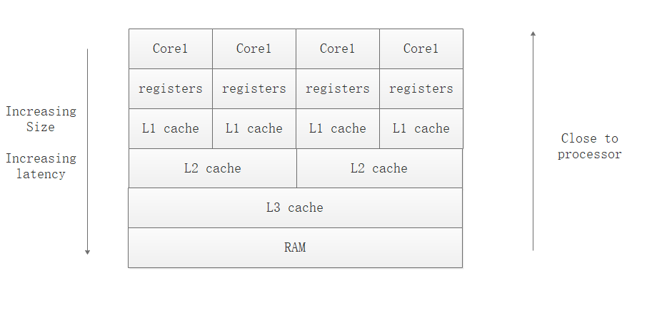
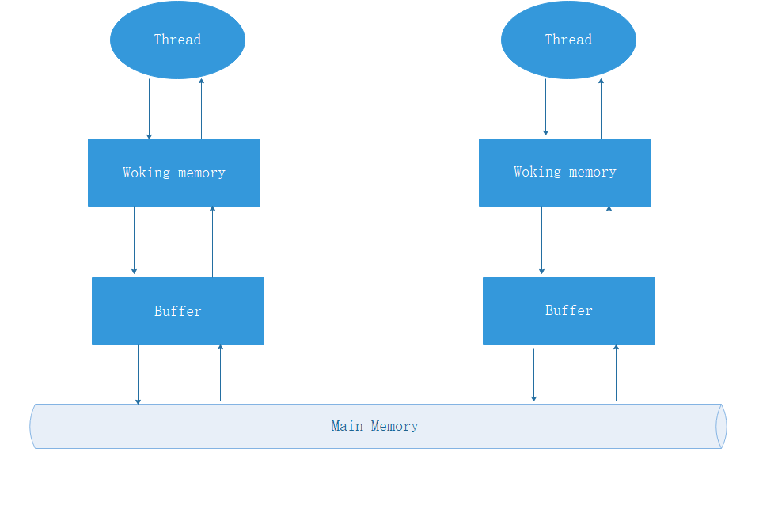

#  线程的八大核心基础知识
##  创建线程的方法

- 创建方式
  - 实现Runnable接口
  - 继承Thread类

- 实现Runnable接口好在哪里？ 继承Thread类是不推荐的，因为它有以下的一些缺点：  

  - 从代码架构角度：具体的任务（run方法）应该和“创建和运行线程的机制（Thread类）”解耦，用runnable对象可以实现解耦。
  -  使用继承Thread的方式的话，那么每次想新建一个任务，只能新建一个独立的线程，而这样做的损耗会比较大（比如重头开始创建一个线程、执行完毕以后再销毁等。如果线程的实际工作内容，也就是run()函数里只是简单的打印一行文字的话，那么可能线程的实际工作内容还不如损耗来的大）。如果使用Runnable和线程池，就可以大大减小这样的损耗。
  -  继承Thread类以后，由于Java语言不支持双继承，这样就无法再继承其他的类，限制了可扩展性。 通常我们优先选择方法1

- 两种方法的本质对比 

  - 方法一和方法二，也就是“实现Runnable接口并传入Thread类”和“继承Thread类然后重写run()”在实现多线程的本质上，并没有区别，都是最终调用了start()方法来新建线程。

  - 这两个方法的最主要区别在于run()方法的内容来源： 

    ```java
     @Override public void run() {     
         if (target != null) {         
             target.run();     
         } 
     } 
    ```

    

  - 方法一：最终调用target.run(); 

  - 方法二：run()整个都被重写

- 两种方式同时使用会出现什么结果

  ```java
  package threadcoreknowledge.createthreads;
  
  /**
   * 同时使用两种方式
   */
  public class BothRunnableThread {
  
      public static void main(String[] args) {
          new Thread(new Runnable() {
              @Override
              public void run() {
                  System.out.println("我来自Runnable");
              }
          }){
              @Override
              public void run() {
                  System.out.println("我来自Thread");
              }
          }.start();
      }
  }
  
  /**
  	会打印 ==》 我来自Thread
  */
  ```

- 有多少种实现线程的方法？总结回答

   答题思路，以下5点：  

  - 从不同的角度看，会有不同的答案。 

  - 典型答案是两种，分别是实现Runnable接口和继承Thread类，然后具体展开说； 

  - 但是，我们看原理，其实Thread类实现了Runnable接口，并且看Thread类的run方法，会发现其实那两种本质都是一样的，run方法的代码如下：

  ```java
   @Override public void run() {     
       if (target != null) {         
           target.run();     
       } 
   } 
  ```

  

  - 方法一和方法二，

    也就是“继承Thread类然后重写run()”和“实现Runnable接口并传入Thread类”在实现多线程的本质上，并没有区别，都是最终调用了start()方法来新建线程。这两个方法的最主要区别在于run()方法的内容来源：

    ​	 方法一：最终调用target.run(); 

    ​	 方法二：run()整个都被重写 

  - 然后具体展开说其他方式； 还有其他的实现线程的方法，例如线程池等，它们也能新建线程，但是细看源码，从没有逃出过本质，也就是实现Runnable接口和继承Thread类。 
  -  结论:我们只能通过新建Thread类这一种方式来创建线程，但是类里面的run方法有两种方式来实现，
    - 第一种是重写run方法，
    - 第二种实现Runnable接口的run方法，然后再把该runnable实例传给Thread类。除此之外，从表面上看线程池、定时器等工具类也可以创建线程，但是它们的本质都逃不出刚才所说的范围。  以上这种描述比直接回答一种、两种、多种都更准确。

## 启动线程的正确方式

- start()和run()

- start源码

  ```java
   public synchronized void start() {
          /**
           * This method is not invoked for the main method thread or "system"
           * group threads created/set up by the VM. Any new functionality added
           * to this method in the future may have to also be added to the VM.
           *
           * A zero status value corresponds to state "NEW".
           */
       	// 进行状态的判断 NEW 状态才可以启动
          if (threadStatus != 0)
              throw new IllegalThreadStateException();
  
          /* Notify the group that this thread is about to be started
           * so that it can be added to the group's list of threads
           * and the group's unstarted count can be decremented. */
          // 加入线程组
          group.add(this);
  
          boolean started = false;
          try {
              // 执行start0方法
              start0();
              started = true;
          } finally {
              try {
                  if (!started) {
                      group.threadStartFailed(this);
                  }
              } catch (Throwable ignore) {
                  /* do nothing. If start0 threw a Throwable then
                    it will be passed up the call stack */
              }
          }
      }
  ```

- 两次执行start 会抛出异常，因为start方法会判断线程的状态是否为NEW状态

- start 最终会调用run方法，为什么还要调用start方法，因为run方法是一个普通方法，只有start方法才会进行线程的准备工作，启动子线程调用run方法执行需要的任务

## 停止线程的方式

**使用interrupt来通知，而不是强制停止**

### 停止的方式

- 通常情况下如何停止

  ```java
  package threadcoreknowledge.stopthreads;
  
  /**
   * run 方法内没有sleep和wait方法下停止线程
   */
  public class RightWayStopThreadWithoutSleep implements Runnable{
  
  
      @Override
      public void run() {
          int num = 0;
          while (!Thread.currentThread().isInterrupted() && num < Integer.MAX_VALUE/2) {
              if (num % 10000 == 0) {
                  System.out.println(num + "是10000的倍数");
              }
              num++;
          }
          System.out.println("线程执行结束");
      }
  
      public static void main(String[] args) throws InterruptedException {
          Thread thread = new Thread(new RightWayStopThreadWithoutSleep());
          thread.start();
          Thread.sleep(2000);
          thread.interrupt();
      }
  }
  ```

  

- 线程被阻塞如何停止

  ```java
  package threadcoreknowledge.stopthreads;
  
  /**
   *  带有sleep的中断线程的方法
   */
  public class RightWayStopThreadWithSleep{
  
  
      public static void main(String[] args) throws InterruptedException {
  
          Runnable runnable = () ->{
              int num = 0;
              while (num <=300 && !Thread.currentThread().isInterrupted()) {
                  if (num % 100 ==0) {
                      System.out.println(num + "是100的倍数");
                  }
                  num++;
              }
  
              try {
                  Thread.sleep(1000); // 睡眠过程中，如果收到停止信号，则会抛出异常java.lang.InterruptedException: sleep interrupted
              } catch (InterruptedException e) {
                  e.printStackTrace();
              }
              System.out.println("任务执行结束了！");
          };
  
          Thread thread = new Thread(runnable);
          thread.start();
          Thread.sleep(500);
          thread.interrupt();
  
      }
  }
  
  ```

  

- 每次迭代之后都阻塞如何停止

  ```java
  package threadcoreknowledge.stopthreads;
  
  /**
   * 每次循环都sleep或wait等待的情况下停止线程
   */
  public class RightWayStopThreadWithSleepEveyLoop {
  
      public static void main(String[] args) throws InterruptedException {
          Runnable runnable = ()->{
              int num = 0;
              try {
                  while (num <=10000 /*&& !Thread.currentThread().isInterrupted()*/){ // 此处不需要每次都判断是否中断
                      if (num % 100 == 0) {
                          System.out.println(num + "是100倍数");
                      }
                      num++;
                      Thread.sleep(10);
                  }
              } catch (InterruptedException e) {
                  e.printStackTrace();
              }
          };
        	// 如果try catch 在while 循环里面 intertupt 是没有生效的
          /**while (num <= 10000 && !Thread.currentThread().isInterrupted()) {
            if (num % 100 == 0) {
              System.out.println(num + "是100的倍数");
            }
  
            num++;
            // try catch 在while的内部线程不会中断
            try {
            	// sleep 会清除interrupt的标记位，如果try catch 的话当前线程的停止标志就会被清除
              Thread.sleep(10);
            } catch (InterruptedException e) {
              e.printStackTrace();
            }
          }*/
  
          Thread thread = new Thread(runnable);
          thread.start();
          Thread.sleep(5000);
          thread.interrupt();
      }
  }
  
  ```

- 最佳实践

  - 优选选择：传递中断

    ```java
    package threadcoreknowledge.stopthreads;
    
    /**
     * catch住InterruptedException优选选择抛出，那么在run方法就会强制try catch
     */
    public class RightWayStopThreadInProd implements Runnable{
    
    
        @Override
        public void run() {
            try {
                while (true){
                    System.out.println("go");
                    throwInMethod();
                }
            } catch (InterruptedException e) {
                System.out.println("保存日志");
                e.printStackTrace();
            }
        }
    
        /**
         * 抛出异常 不要tryCatch 如果tryCatch就达不到停止的效果
         * @throws InterruptedException
         */
        private void throwInMethod() throws InterruptedException {
            Thread.sleep(2000);
            /*try {
                Thread.sleep(2000);
            } catch (InterruptedException e) {
                e.printStackTrace();
            }*/
        }
    
        public static void main(String[] args) throws InterruptedException {
            Thread thread = new Thread(new RightWayStopThreadInProd());
            thread.start();
            Thread.sleep(1000);
            thread.interrupt();
        }
    }
    
    ```

    

  - 不想或无法传递：**恢复中断**

    ```java
    package threadcoreknowledge.stopthreads;
    
    /**
     * catch住InterruptedException后调用Thread.currentThread().interrupt()来
     */
    public class RightWayStopThreadInProd2 implements Runnable{
    
    
        @Override
        public void run() {
            while (true){
                if (Thread.currentThread().isInterrupted()){
                    System.out.println("Interrupt 线程被中断了");
                    break;
                }
                System.out.println("go");
                reInterrupt();
            }
        }
    
        /**
         * 如果一定要catch 那么在catch后面再继续中断线程
         * @throws InterruptedException
         */
        private void reInterrupt() {
            try {
                Thread.sleep(2000);
            } catch (InterruptedException e) {
                Thread.currentThread().interrupt(); // 继续中断异常
                e.printStackTrace();
            }
        }
    
        public static void main(String[] args) throws InterruptedException {
            Thread thread = new Thread(new RightWayStopThreadInProd2());
            thread.start();
            Thread.sleep(1000);
            thread.interrupt();
        }
    }
    
    ```

    

  - 不应屏蔽中断

    - 如果屏蔽中断会产生信息不畅通

- 响应中断的方式

  - Object类的 wait()、wait(long) 、wait(long,int)
  - Thread.sleep(long)/sleep(long,int)
  - Thread.join()/join(long)/join(long,int)
  - java.util.concurrent.BlockingQueue.take()/put(E)
  - java.util.concurrent.locks.Lock.lockInterruptibly()
  - java.util.concurrent.CountDownLatch.await()
  - java.util.concurrent.CyclicBarrier.await()
  - java.util.concurrent.Exchanger.exchange(V)
  - java.nio.channels.InterruptibleChannel相关方法
  - java.nio.channels.Selector的相关方法


### 错误停止的方法

#### 第一种方式，编译器会给出提示

- stop
  - 可能导致数据错乱，但是会释放monitor锁
- suspend
  - 不会释放锁，带着锁挂起，可能会导致死锁
- resume
  - 不会释放锁，带着锁挂起，可能会导致死锁

#### 第二种方式，需要注意

- 用volatile 设置boolean的标记位

  - 看上去可行

  - 错误原因

    为什么用volatile停止线程不够全面 

    ​		解答：这种做法是错误的，或者说是不够全面的，在某些情况下虽然可用，但是某些情况下有严重问题。 这种方法在《Java并发编程实战》中被明确指出了缺陷，我们一起来看看缺陷在哪里： 此方法错误的原因在于，如果我们遇到了线程长时间阻塞（这是一种很常见的情况，例如生产者消费者模式中就存在这样的情况），就没办法及时唤醒它，或者永远都无法唤醒该线程，而interrupt设计之初就是把wait等长期阻塞作为一种特殊情况考虑在内了，我们应该用interrupt思维来停止线程。

  - 修正方式

    - 使用interrupt

### 停止线程相关函数解析

#### interrupt

- 如何分析native方法 去看openjdk源码


#### 判断是否已中断的方法

- static boolean interrupted()

  - 监测当前线程是否被中断 true 中断 false 没有中断，返回之后将线程中断状态设置为false，那么需要自己进行处理，抛出异常或再次执行interrupted中断

- boolean isInterrupted()

  - 监测当前线程是否被中断

- Thread.intertupted()目标对象

  - 是当前调用的线程

    ```java
    package threadcoreknowledge.stopthreads;
    
    public class RightWayInterrupted {
    
        public static void main(String[] args) throws InterruptedException {
            Thread threadOne = new Thread(new Runnable() {
                @Override
                public void run() {
                    for (; ; ) {
    
                    }
                }
            });
    
            threadOne.start();
            threadOne.interrupt();// 发送中断信号
    
            System.out.println("IsInterrupted:" + threadOne.isInterrupted());
            System.out.println("IsInterrupted:" + threadOne.interrupted());
            System.out.println("IsInterrupted:" + Thread.interrupted());
            System.out.println("IsInterrupted:" + threadOne.isInterrupted());
            threadOne.join();
            System.out.println("main thread is over ");
    
        }
    }
    
    /**
    	输出结果
    	IsInterrupted:true
        IsInterrupted:false
        IsInterrupted:false
        IsInterrupted:true
    */
    ```

### 面试问题

- 如何停止线程

  >1.采用interrupt来请求，好处可以保证数据安全，要把中断的权利交给被中断线程
  >
  >2.想要停止线程，要请求方、被请求方、子方法被调用方互相配合
  >
  >​	发出停止请求
  >
  >   被停止方法需要处理终端信号
  >
  >   如果是run方法调用了其他方法，需要向上抛出异常
  >
  >3.最后说错误的方法
  >
  >​	stop和suspend被弃用，volatile的boolean方式无法处理长时间阻塞的情况

- 如何处理不可中断的阻塞

  >如果线程阻塞是由于调用了 wait()，sleep() 或 join() 方法，你可以中断线程，通过抛出 InterruptedException 异常来唤醒该线程。
  >
  > 但是对于不能响应InterruptedException的阻塞，很遗憾，并没有一个通用的解决方案。 但是我们可以利用特定的其它的可以响应中断的方法，比如ReentrantLock.lockInterruptibly()，比如关闭套接字使线程立即返回等方法来达到目的。 答案有很多种，因为有很多原因会造成线程阻塞，所以针对不同情况，唤起的方法也不同

## 线程的生命周期

### 线程的6种状态

- New : 以创建但未启动 new Thread() 未调用start()
- Runnable：调用start()方法后就会进入Runnable，对于操作系统中的read和running
- Blocked：当线程进入synchronized修饰的代码，并且该锁被其他线程拿走了
- Waiting：调用以下方法Object.wait()、Thread.join()、LockSupport.park()方法
- Timed Waiting：调用以下方法Object(time)、Thread.sleep(time)、Thread.join(time)、LockSupport.parkNanos(time)、LockSupport.parkUnitil(time)
- Terminated：线程执行完成、出现了一个没有被捕获的异常

### 每个状态的含义

```java
package threadcoreknowledge.sixstates;

/**
 * 展示线程的New Runnable Terminated，即时是正在运行也是Runnable状态
 */
public class NewRunnableTerminated implements Runnable{


    public static void main(String[] args) {
        NewRunnableTerminated r = new NewRunnableTerminated();
        Thread thread = new Thread(r);
        System.out.println(thread.getState()); // New状态
        thread.start();
        System.out.println(thread.getState()); // Runnable
        try {
            Thread.sleep(10);
        } catch (InterruptedException e) {
            e.printStackTrace();
        }
        System.out.println(thread.getState()); // Runnable

        try {
            Thread.sleep(1000);
        } catch (InterruptedException e) {
            e.printStackTrace();
        }
        System.out.println(thread.getState());
    }

    @Override
    public void run() {
        for (int i = 0; i < 1000; i++) {
            System.out.println(i);
        }
    }
}

```


```java
package threadcoreknowledge.sixstates;

/**
 * 展示 Blocked Waiting Timed_Waiting
 */
public class BlockedWaitingTimedWaiting implements Runnable{


    public static void main(String[] args) {
        BlockedWaitingTimedWaiting r = new BlockedWaitingTimedWaiting();
        Thread t1 = new Thread(r);
        Thread t2 = new Thread(r);

        t1.start();
        try {
            Thread.sleep(1000);
        } catch (InterruptedException e) {
            e.printStackTrace();
        }
        t2.start();
        // 打印TIMED_WAITING 因为在sleep中
        System.out.println(t1.getState());
        // 打印BLOCKED 因为没有拿到monitor锁
        System.out.println(t2.getState());

        try {
            Thread.sleep(2300);
        } catch (InterruptedException e) {
            e.printStackTrace();
        }
        System.out.println(t1.getState());


    }

    @Override
    public void run() {
        try {
            syn();
        } catch (InterruptedException e) {
            e.printStackTrace();
        }
    }

    private synchronized void syn() throws InterruptedException {
        Thread.sleep(2000);
        wait();
    }
}

```


### 状态的转化图示


### 阻塞状态是什么

**一般习惯把Blocked、Waiting、Timed_waiting 都称之为阻塞状态**

### 面试问题

- 线程有几种状态，线程的生命周期

## Thread和Object中重要的方法

### 重要方法概览

| 类     | 方法名                    | 简介                   |
| ------ | ------------------------- | ---------------------- |
| Thread | sleep相关                 | 线程进入休眠           |
|        | join                      | 等待其他线程执行完毕   |
|        | yield相关                 | 放弃获取到的CPU资源    |
|        | currentThread             | 获取当前执行线程的引用 |
|        | start,run相关             | 启动线程相关           |
|        | interrupt相关             | 中断线程               |
|        | stop、suspend、resume相关 | 已废弃                 |
| Object | wait/notify/notifyAll     | 线程休息或唤醒         |


### wait、notify、notifyAll方法详解

- 作用、用法

  - 阻塞阶段
    - 必须先拥有对象的monitor锁
    - 线程调用wait方法阻塞后，只有以下四种情况会被唤醒
      - 另一个线程调用monitor锁的notify方法，且刚好被唤醒的是本线程
      - 另外一个线程调用monitor锁的notifyAll方法
      - wait设置了超时时间，时间到了就会唤醒，如果传入0就进入了永久等待
      - 线程自身调用了interrupt
  - 唤醒阶段
    - notify唤醒单个正在等待的线程，这个是随机的，多个等待时随机选择，在synchronized内部使用
    - notifyAll 唤醒所有等待的线程，在synchronized内部使用
  - 遇到中断
    - wait 方法之后中断会抛出InterruptException 释放monitor锁

- 代码演示

  - 普通用法

    ```java
    package threadcoreknowledge.threadobjectcommonmethods;
    
    /**
     * wait和 notify 的基本用法
     *  代码执行顺序
     *  证明wait 释放了锁
     */
    public class Wait {
    
        public static Object object = new Object();
    
        public static void main(String[] args) throws InterruptedException {
            Thread1 t1 = new Thread1();
            Thread2 t2 = new Thread2();
            t1.start();
            Thread.sleep(200);
            t2.start();
    
    
        }
    
        static class Thread1 extends Thread {
    
            @Override
            public void run() {
                synchronized (object) {
                    System.out.println("线程"+ Thread.currentThread().getName()+"开始执行");
                    try {
                        object.wait(); //释放了锁
                    } catch (InterruptedException e) {
                        e.printStackTrace();
                    }
    
                    System.out.println("线程" + Thread.currentThread().getName()+"获取到了锁");
                }
            }
    
        }
    
        static class Thread2 extends Thread {
            @Override
            public void run() {
                synchronized (object) {
                    object.notify(); // 虽然唤醒了但是还是没有释放锁，知道synchronized结束
                    System.out.println("线程" + Thread.currentThread().getName()+ "调用了notify");
                }
            }
        }
    }
    
    ```

  - notify 和notifyAll

    ```java
    package threadcoreknowledge.threadobjectcommonmethods;
    
    /**
     * 3个线程，线程1 和线程2 被阻塞，线程3唤醒他们，notify 和 notifyAll 唤醒他们
     *
     */
    public class WaitNotifyNotifyAll implements Runnable{
    
        private static final Object resourceA = new Object();
    
        public static void main(String[] args) {
            WaitNotifyNotifyAll r = new WaitNotifyNotifyAll();
            Thread t1 = new Thread(r);
            Thread t2 = new Thread(r);
            Thread t3 = new Thread(() -> {
                synchronized (resourceA) {
                    resourceA.notifyAll(); // 此处如果是notify则只能唤醒一个线程
                    System.out.println(Thread.currentThread().getName() + " notified");
                }
            });
            t1.start();
            t2.start();
            try {
                Thread.sleep(200);
            } catch (InterruptedException e) {
                e.printStackTrace();
            }
            t3.start();
        }
    
        @Override
        public void run() {
    
            synchronized (resourceA) {
                System.out.println(Thread.currentThread().getName() + " got resourceA lock");
    
                try {
                    System.out.println(Thread.currentThread().getName() +" waits to start, release lock ");
                    resourceA.wait();
                    System.out.println(Thread.currentThread().getName() +" is waiting to end");
                } catch (InterruptedException e) {
                    e.printStackTrace();
                }
    
            }
    
        }
    }
    
    ```

  - 锁之间是独立的

    ```java
    package threadcoreknowledge.threadobjectcommonmethods;
    
    /**
     * 证明wait只释放当前的那把锁
     */
    public class WaitNotifyReleaseOwnMonitor {
    
    
        private static volatile Object resouceA = new Object();
        private static volatile Object resouceB = new Object();
    
        public static void main(String[] args) {
            Thread t1 = new Thread(() -> {
                synchronized (resouceA) {
                    System.out.println(Thread.currentThread().getName() + " got resourceA lock ");
                    synchronized (resouceB) {
                        System.out.println(Thread.currentThread().getName() + " got resourceB lock ");
                        try {
                            System.out.println(Thread.currentThread().getName() + " releases resourceA lock ");
                            resouceA.wait();
                        } catch (InterruptedException e) {
                            e.printStackTrace();
                        }
                    }
                }
    
            });
    
            Thread t2 = new Thread(() -> {
                try {
                    Thread.sleep(1000);
                } catch (InterruptedException e) {
                    e.printStackTrace();
                }
                synchronized (resouceA) {
                    System.out.println(Thread.currentThread().getName() + " got resourceA lock. ");
                    System.out.println(Thread.currentThread().getName() + " try got resourceA lock. ");
                    synchronized (resouceB) {
                        System.out.println(Thread.currentThread().getName() + " got resourceB lock. ");
                    }
                }
            });
    
            t1.start();
            t2.start();
        }
    }
    
    ```

    

- 特点和性质

  - 必须先拥有monitor
  - 只能唤醒其中一个
  - 属于Object类
  - 类似功能 Condition，jdk的阻塞队列使用了Condition

- 原理

  - 多个线程同时进行锁的抢占
  - 其中一个获取到锁进入线程执行，执行过程中如果调用了wait方法就会释放锁
  - 释放锁之后进入等待状态，其他线程开始获取锁，继续执行

- 实现生产者和消费者模式

  - 使用wait和notify实现

    ```java
    package threadcoreknowledge.threadobjectcommonmethods;
    
    import java.util.Date;
    import java.util.LinkedList;
    
    /**
     * 用 notify /wait 方式实现 不用阻塞队列
     */
    public class ProducerConsumerModel {
    
    
        public static void main(String[] args) {
            EventStorage eventStorage = new EventStorage();
            Producer producer = new Producer(eventStorage);
            Consumer consumer = new Consumer(eventStorage);
            new Thread(producer).start();
            new Thread(consumer).start();
        }
    }
    
    
    class Producer implements Runnable{
    
        private EventStorage storage;
    
        public Producer(EventStorage storage) {
            this.storage = storage;
        }
    
        @Override
        public void run() {
            for (int i = 0; i < 100; i++) {
    
                storage.put();
            }
        }
    }
    
    class Consumer implements Runnable{
    
        private EventStorage storage;
    
        public Consumer(EventStorage storage) {
            this.storage = storage;
        }
    
        @Override
        public void run() {
            for (int i = 0; i < 100; i++) {
                storage.take();
            }
        }
    }
    
    
    class EventStorage{
        private int maxSize;
        private LinkedList<Date> storage;
    
        public EventStorage(){
            maxSize = 10;
            storage = new LinkedList<>();
        }
    
        public synchronized void put(){
            while (storage.size() == maxSize) {
                try {
                    wait();
                } catch (InterruptedException e) {
                    e.printStackTrace();
                }
            }
            storage.add(new Date());
            System.out.println("仓库里有了" + storage.size() + "个产品");
            notify();
    
        }
    
        public synchronized void take(){
            while (storage.size() == 0) {
                try {
                    wait();
                } catch (InterruptedException e) {
                    e.printStackTrace();
                }
            }
            System.out.println("拿到了" + storage.poll() + "，仓库的还剩下" + storage.size());
            notify();
        }
    }
    
    
    
    ```

    

- 注意点
  - 当线程调用了wait方法释放了锁，但是刚刚被唤醒的时候，不一定能立即拿到锁，notify的线程可能还持有锁，此时线程会进入blocked状态
  - 如果在等待过程中发生异常，线程直接进入Terminated状态
- 常见面试问题
  
  - 用程序实现交替打印0-100的奇偶数
  
    - 使用synchronized实现，会造成资源的浪费
  
      ```java
      package threadcoreknowledge.threadobjectcommonmethods;
      
      /**
       * 使用synchronized 实现交替打印0-100的奇偶数，效率比较低下
       */
      public class WaitNotifyPrintOddEvenSyn {
      
          // 新建两个线程
          // 一个处理偶数，一个处理奇数(用位运算)
          private static int count;
          private static final Object lock = new Object();
      
          public static void main(String[] args) {
              Thread enveThread = new Thread(new Runnable() {
                  @Override
                  public void run() {
      
                      while (count < 100) {
                          synchronized (lock) {
                              if ((count&1) == 0) { // 速度更快
                                  System.out.println(Thread.currentThread().getName() + "：" + count);
                                  count++;
                              }
      
                          }
                      }
                  }
              },"偶数");
      
              Thread oddThread = new Thread(new Runnable() {
                  @Override
                  public void run() {
      
                      while (count < 100) {
                          synchronized (lock) {
                              if ((count&1) != 0) { // 速度更快
                                  System.out.println(Thread.currentThread().getName() + "：" + count);
                                  count++;
                              }
                          }
                      }
                  }
              },"奇数");
      
              enveThread.start();
              oddThread.start();
          }
      
      
      }
      
      ```
  
    - 使用wait 和 notify实现
  
      ```java
      package threadcoreknowledge.threadobjectcommonmethods;
      
      /**
       * 使用wait 和notify
       * 1.拿到锁就打印
       * 2.打印完唤醒其他线程，自己wait
       */
      public class WaitNotifyPrintOddEvenWait {
      
          private static int count = 0;
          private static final Object lock = new Object();
      
          public static void main(String[] args) {
      
              Runnable runnable = () -> {
                  while (count <=100 ) {
                      synchronized (lock) {
                          System.out.println(Thread.currentThread().getName() + ":" + count++);
                          lock.notify();
                          try {
                              if (count <=100) {
                                  lock.wait();
                              }
                          } catch (InterruptedException e) {
                              e.printStackTrace();
                          }
                      }
                  }
              };
      
              Thread t1 = new Thread(runnable);
              Thread t2 = new Thread(runnable);
              t1.start();
              t2.start();
      
          }
      }
      
      ```
  
    - 手写生产者和消费者模式
  
    - wait 为什么需要在synchronized代码块中使用，而sleep则不需要
  
      - 为了防止了死锁，wait释放掉了monitor锁
      - sleep只是针对自己的线程，不会设计到多个线程
  
    - wait 和 notify 定义在Object类里，而sleep定义在Thread里面
  
      - wait和notify 是锁级别操作，而锁是绑定到对象的，如果定义在Thread中，就会造成局限性，如果一个线程持有多个锁，需要锁之间需要配合
  
    - wait属于Object ,如果调用Thread.wait会怎么样
  
      - Thread 退出的时候自动notify
  
    - notify和notifyAll如何抉择
  
      - 是唤醒单个还是多个线程
  
    - notifyAll会唤醒所有的线程，但只有一个成功，失败的怎么样
  
      - 会进入等待

### sleep方法详解

#### 作用

- 我只想让线程在预期的时间执行，其他时候不要占用CPU资源

#### 特点

- 不释放锁
  
  - 包含synchronized和lock
  
- 响应中断
  
  - sleep期间会检查中断状态，如果中断，则抛出 InterruptedException 清空中断状态
  
  >sleep方法会让线程进入Timed_waiting状态，并且不占用CPU资源，但是不会释放锁，直到规定时间后再继续执行，休眠的过程中如果被中断，会抛出异常并清除中断状态

- 常见面试问题
  - wait/notify、sleep的异同
    - 相同
      - wait 和 sleep方法都可以是线程阻塞，对应的线程状态位waiting和Timed_waiting
      - wait 和 sleep 方法都可以响应中断
    - 不同
      - wait 方法的执行必须在同步方法中进行，而sleep不需要
      - 同步方法里执行sleep方法时，不会释放monitor，但是wait会释放monitor锁
      - sleep方法短暂休眠之后会主动退出阻塞，而没有制定时间的wait方法则需要被其他线程中断后才能退出阻塞
      - wait和notify、notfiyAll时Object方法，而sleep时Thread 的方法

### join方法详解

- 作用

  - 因为新的线程加入了我们，我们需要等他执行完再出发

- 用法

  - main等待thread1执行完毕，注意谁等谁

- 三个例子

  等待资源加载完成

  - 普通用法

    ```java
    package threadcoreknowledge.threadobjectcommonmethods;
    
    import java.util.concurrent.TimeUnit;
    
    /**
     * 演示join ，注意语句的输出顺序
     */
    public class Join {
        public static void main(String[] args) throws InterruptedException {
    
    
            Runnable r = () ->{
                try {
                    TimeUnit.SECONDS.sleep(1);
                } catch (InterruptedException e) {
                    e.printStackTrace();
                }
                System.out.println(Thread.currentThread().getName() + "执行完毕");
            };
    
            Thread t1 = new Thread(r);
            Thread t2 = new Thread(r);
            t1.start();
            t2.start();
            System.out.println("开始等待子线程运行完毕");
            t1.join();
            t2.join();
            System.out.println("所有线程执行完毕");
        }
    }
    
    ```

  - 遇到中断

    ```java
    package threadcoreknowledge.threadobjectcommonmethods;
    
    import java.util.concurrent.TimeUnit;
    
    /**
     * 等待的是主线程，主线程interrupt
     */
    public class JoinInterrupt {
        public static void main(String[] args) {
            Thread mainThread = Thread.currentThread();
            Runnable r = () -> {
                try {
                    mainThread.interrupt();
                    TimeUnit.SECONDS.sleep(1);
                    System.out.println(Thread.currentThread().getName() + "finish!");
                } catch (InterruptedException e) {
                    System.out.println("子线程被中断了");
                }
            };
    
            Thread thread = new Thread(r);
            thread.start();
            System.out.println("等待子线程运行完毕");
    
            try {
                thread.join();
            } catch (InterruptedException e) {
                System.out.println(Thread.currentThread().getName() + "中断了");
                thread.interrupt();
            }
            System.out.println("子线程已运行完成");
        }
    }
    ```

  - join时线程的状态，等待线程为Waiting状态

    ```java
    package threadcoreknowledge.threadobjectcommonmethods;
    
    
    
    /**
     * 先join 再main线程的状态
     */
    public class JoinThreadState {
    
        public static void main(String[] args) throws InterruptedException {
            Thread mainThread = Thread.currentThread();
            Thread thread = new Thread(new Runnable() {
                @Override
                public void run() {
                    try {
                        Thread.sleep(3000);
                        System.out.println(mainThread.getState());
                        System.out.println(Thread.currentThread().getName() + "子线程执行完毕了");
                    } catch (InterruptedException e) {
                        e.printStackTrace();
                    }
                }
            });
            thread.start();
            System.out.println("等待子线程执行完毕");
            thread.join();
            System.out.println("子线程运行完毕");
    
    
        }
    }
    
    ```

    

- CountDownLatch 和 CyclicBarrier类的使用

- 原理

  - join底层使用了wait但是没有notify的方法

  - 因为Thread.run 方法执行完会执行ensure_join 唤醒，所以不建议采用Thread为lock

  - 等价代码

    ```java
    synchronized (t1) {
      t1.wait();
    }
    ```

- 常见面试问题

  - join期间，线程处于哪种线程状态
    - 等待的线程处于waiting状态

### yield方法详解

- 作用
  - 释放我的CPU时间片，但是线程还是Runnable状态，持有锁，不会阻塞
- 定位
  - JVM不保证遵循
- yield和sleep区别
  - sleep 会进入阻塞状态，但是yield还是处于Runnable状态

### Thread.currentThread()方法详解

### start 和 run 方法

- run只是普通方法
- start方法时线程启动的方法

### stop、suspend、resume方法

- 弃用


### 面试问题

- 为什么线程通信的方法wait()、notify()和notifyAll()被定义在Object类，而sleep定义在Thread类里
- 用3种方法实现生产者模式
- JavaSE8 和java1.8和JDK8是什么关系，是同一东西吗？
- Join 和 sleep 和 wait期间线程的状态分别是什么，为什么？


## 线程各种属性

### 属性纵览

| 属性名称                 | 用途                                                         |
| ------------------------ | ------------------------------------------------------------ |
| 编号（ID）               | 每一个线程有自己的ID，用于标示不同的线程                     |
| 名称（Name）             | 作用让用户或程序员在开发，调试，运行过程中，更容易区分每个不同的线程，定位问题 |
| 是否是守护线程(isDaemon) | true代表是守护线程，false代表线程是非守护线程，就是用户线程  |
| 优先级(Priority)         | 优先级这个属性的目的是告诉线程调度器，用户希望哪些线程相对多运行，哪些线程少运行 |

### 线程id

自增的，初始化为0 ，但是里面是使用++i操作，所以是1开始的

### 线程的名字

- 默认线程名字的源码分析
- 如何修改线程的名字
  - 构造方法传入
  - setName

### 守护线程

- 作用：给用户线程提供服务，看线程是否阻止 JVM 停止
- 特性
  - 线程的类型默认继承自父线程，守护线程创建的线程也是守护线程
  - 被谁启动，都是由jvm启动
  - 不影响jvm的退出，jvm退出只看有没有用户线程，没有用户线程就可以退出
- 守护线程和普通线程的区别
  - 整体无区别，唯一区别就是是否会影响jvm退出
- 我们是否需要给线程设置为守护线程
  - 我们不应该把自己的用户线程设置为守护线程，如果我们的线程正在读取文件，但是此线程被设置为守护线程了，当jvm检测到没有用户线程了，突然停止，此时会造成数据的不一致


### 线程的优先级

- 10个级别，默认是5 
- 程序的设计不应该依赖于优先级
  - 不同的操作系统不一样，windows中只有 7 个级别 linux 无优先级
  - 优先级会被操作系统改变


### 常见面试问题

- 什么时候需要设置守护线程
  - 通常我们不需要设置守护线程，jvm的守护线程足够
- 我们如何利用程序优先级来帮助程序运行，有哪些禁忌
  - 我们不应该用优先级来帮助程序运行，因为每个操作系统对优先级不一样
- 不同的操作系统如何处理优先级问题
  - windows 有7个优先级，而且有优先级推进程序，linux没有

## 未捕获异常如何处理

- 处理方式
  - UncaughtExceptionHandler
- 什么需要 UncaughtExceptionHandler
  - 主线程可以轻松的发现异常，子线程确不可以
    - 子线程发生异常，主线程依然在继续执行
  - 子线程的异常无法用传统方式捕获
  - 不能直接捕获的后果，提高健壮性
- 两种解决方案
  - 方案一（不推荐）：手动在每个run方法里面进行try catch
  - 方案二 （推荐）：
    - UncaughtExceptionHandler 接口
      - void uncaughtException(Thread t, Throwable e)
    - 实现方式
      - 给程序统一设置
      - 给每个线程单独设置
      - 给线程池设置

### 常见面试问题

- 异常体系图
  - Throwable
    - Error
    - Exception
      - RuntimeException
      - Exception
- 实际工作中，如何全局处理异常，为什么要全局处理？不处理行不行 ？
  - 定义自己的UncaughtExceptionHandler 类，设置线程的UncaughtExceptionHandler为自己定义的异常处理类
  - 如果不处理全局异常，会把异常打印到客户端，对于系统不安全，
  - 不处理不行，会造成系统错误不会被及时发现
- run方法是否可以抛出异常，如果抛出异常，线程的状态会怎么样
  - 不可以抛出异常，如果RuntimeException 没处理，线程会终止
- 线程中如何处理某个未处理异常或者说叫做运行时异常
  - 定义自己的UncaughtExceptionHandler 类，设置线程的UncaughtExceptionHandler为自己定义的异常处理类

## 线程会产生的问题

### 线程安全

- 什么是线程安全

  >Brian Goetz  《Java Concurrecy In Practice》：
  >
  >​	当多个线程访问一个对象时，如果不用考虑这些线程在运行时环境下的调度和交替执行，也不需要额外的同步，或者在调用方进行任何其他的协调操作，调用这个对象的行为都可以获得正确的结果，那么这个对象就是线程安全的

  - 一些线程不安全的时候
    - 比如get同时set需要额外处理
  - 线程安全的成本
    - 运行速度
    - 设计成本
    - trade off
  - 如果一个类不用于多线程就不需要进行多线程设计

- 什么情况下会出现线程安全，怎么避免

  >数据征用：同时写
  >
  >竞争条件：执行顺序问题
  - 数据结果错误：消失的 a++

    ```java
    package threadcoreknowledge.concurrcyinpractice;
    
    
    import java.util.concurrent.BrokenBarrierException;
    import java.util.concurrent.CyclicBarrier;
    import java.util.concurrent.atomic.AtomicInteger;
    
    /**
     * a++运行结果出错，并找出出错的位置
     */
    public class MultiThreadsError implements Runnable{
        int index = 0;
        static AtomicInteger realIndex = new AtomicInteger();
        static AtomicInteger wrongCount = new AtomicInteger();
        final boolean[] marked = new boolean[10000000];
        static volatile MultiThreadsError multiThreadsError = new MultiThreadsError();
        static volatile CyclicBarrier cyclicBarrier1 = new CyclicBarrier(2);
        static volatile CyclicBarrier cyclicBarrier2 = new CyclicBarrier(2);
    
    
        public static void main(String[] args) throws InterruptedException {
            Thread t1 = new Thread(multiThreadsError);
            Thread t2 = new Thread(multiThreadsError);
            t1.start();
            t2.start();
            t1.join();
            t2.join();
            System.out.println("表面上的错误" + multiThreadsError.index);
            System.out.println("真正运行的次数" + realIndex);
            System.out.println("发生错误的次数" + wrongCount);
    
    
        }
    
        @Override
        public void run() {
            marked[0] = true;
            for (int i = 0; i < 10000; i++) {
                try {
                    cyclicBarrier2.reset();
                    cyclicBarrier1.await();
                } catch (InterruptedException e) {
                    e.printStackTrace();
                } catch (BrokenBarrierException e) {
                    e.printStackTrace();
                }
                index++;
                // 1 - 1 false
                // 2 - 2 true 这种没有问题
                try {
                    cyclicBarrier1.reset();
                    cyclicBarrier2.await();
                } catch (InterruptedException e) {
                    e.printStackTrace();
                } catch (BrokenBarrierException e) {
                    e.printStackTrace();
                }
                realIndex.incrementAndGet();
                synchronized (multiThreadsError){
                    if (marked[index] && marked[index-1]) {
                        System.out.println("发生错误：" + index);
                        wrongCount.incrementAndGet();
                    }
                    marked[index] =true;
                }
    
            }
        }
    }
    
    
    ```

  - 死锁，活锁，饥饿

    ```java
    package threadcoreknowledge.concurrcyinpractice;
    
    /**
     * 演示死锁
     */
    public class MultiThreadErrors2 implements Runnable{
    
        int flag = 1;
    
        static Object object1 = new Object();
        static Object object2 = new Object();
    
        public static void main(String[] args) {
            MultiThreadErrors2 r1 = new MultiThreadErrors2();
            MultiThreadErrors2 r2 = new MultiThreadErrors2();
            r1.flag = 1;
            r2.flag = 0;
            Thread t1 = new Thread(r1);
            Thread t2 = new Thread(r2);
            t1.start();
            t2.start();
    
    
        }
        @Override
        public void run() {
            System.out.println("flag = " + flag) ;
            if (flag == 1) {
                synchronized (object1){
                    try {
                        Thread.sleep(500);
                    } catch (InterruptedException e) {
                        e.printStackTrace();
                    }
                    synchronized (object2){
                        System.out.println("1");
                    }
                }
            }
    
            if (flag == 0) {
                synchronized (object2){
                    try {
                        Thread.sleep(500);
                    } catch (InterruptedException e) {
                        e.printStackTrace();
                    }
                    synchronized (object1){
                        System.out.println("0");
                    }
                }
            }
        }
    }
    
    ```

    

  - 对象发布和初始化的时候的安全问题

    - 什么是发布
      - 对象声明为public
      - 方法return 一个对象
      - 类对象作为参数传入其他类的方法
      
    - 什么是逸出
      - 方法返回一个private对象 （private的本意是不让外部访问）
      
        ```java
        package threadcoreknowledge.concurrcyinpractice;
        
        import java.util.HashMap;
        import java.util.Map;
        
        /**
         * 发布逸出
         */
        public class MultiThreadError3 {
        
            private Map<String,String> states;
        
            public MultiThreadError3() {
                this.states = new HashMap<>();
                states.put("1","周一");
                states.put("2","周二");
                states.put("3","周三");
                states.put("4","周四");
            }
        
            public Map<String,String> getStates(){
                return states;
            }
        
            public static void main(String[] args) {
                MultiThreadError3 multiThreadError3 = new MultiThreadError3();
                Map<String, String> states = multiThreadError3.getStates();
                System.out.println(states.get("1"));
                states.remove("1");
                System.out.println(states.get("1"));
        
            }
        }
        ```
      
        
      
      - 还未完成初始化（构造函数没有完全执行完毕）就把对下提供给外界
        - 在构造函数中未初始化完毕就this赋值
        
          ```java
          package threadcoreknowledge.concurrcyinpractice;
          
          /**
           * 构造函数未初始化完成就this赋值
           */
          public class MultiThreadError4 {
              static Point point;
          
              public static void main(String[] args) throws InterruptedException {
                  new PointMaker().start();
                  Thread.sleep(10);
                  if (point != null) {
                      System.out.println(point);
                  }
              }
          }
          
          class Point{
              private final int x,y;
          
              public Point(int x, int y) throws InterruptedException {
                  this.x = x;
                  MultiThreadError4.point = this;
                  Thread.sleep(100);
                  this.y = y;
              }
          
          
              @Override
              public String toString() {
                  return "Point{" +
                          "x=" + x +
                          ", y=" + y +
                          '}';
              }
          }
          
          
          class PointMaker extends Thread{
          
          
              @Override
              public void run() {
                  try {
                      new Point(1,1);
                  } catch (InterruptedException e) {
                      e.printStackTrace();
                  }
              }
          }
          ```
        
          
        
        - 隐式逸出 注册监听事件
        
          ```java
          package threadcoreknowledge.concurrcyinpractice;
          
          /**
           * 观察者模式
           */
          public class MultiThreadError5 {
              int count = 0;
          
              public static void main(String[] args) {
                  MySource mySource = new MySource();
                  new Thread(new Runnable() {
                      @Override
                      public void run() {
                          try {
                              Thread.sleep(10);
                          } catch (InterruptedException e) {
                              e.printStackTrace();
                          }
                          mySource.eventCome(new Event() {
          
                          });
                      }
                  }).start();
                  MultiThreadError5 multiThreadError5 = new MultiThreadError5(mySource);
              }
          
              public MultiThreadError5(MySource mySource) {
                  // 内部类持有外部类的this对象
                  mySource.registerListener(new EventListener() {
                      @Override
                      public void onEvent(Event e) {
                          System.out.println("\n我得到的数字是" + count);
                      }
                  });
                  for (int i = 0; i < 10000; i++) {
                      System.out.print(i);
                  }
                  count = 100;
              }
          
              static class MySource {
                  private EventListener listener;
                  void registerListener(EventListener eventListener){
                      this.listener = eventListener;
                  }
          
                  void eventCome(Event e) {
                      if (listener != null){
                          listener.onEvent(e);
                      }else{
                          System.out.println("还未完成初始化");
                      }
                  }
              }
          
              interface EventListener{
                  void onEvent(Event e);
              }
              interface Event{
          
              }
          }
          ```
        
        - 构造函数中运行线程
        
          ```java
          package threadcoreknowledge.concurrcyinpractice;
          
          import java.util.HashMap;
          import java.util.Map;
          
          /**
           * 发布逸出
           */
          public class MultiThreadError6 {
          
              private Map<String,String> states;
          
              public MultiThreadError6() {
                  new Thread(new Runnable() {
                      @Override
                      public void run() {
                          states = new HashMap<>();
                          states.put("1","周一");
                          states.put("2","周二");
                          states.put("3","周三");
                          states.put("4","周四");
                      }
                  }).start();
              }
          
              public Map<String,String> getStates(){
                  return states;
              }
          
              public static void main(String[] args) {
                  MultiThreadError6 multiThreadError3 = new MultiThreadError6();
                  Map<String, String> states = multiThreadError3.getStates();
                  System.out.println(states.get("1"));
                  states.remove("1");
                  System.out.println(states.get("1"));
          
              }
          }
          
          ```
      
    - 如何解决逸出
    
      - 解决方法返回private属性 - 返回副本
    
        ```java
        package threadcoreknowledge.concurrcyinpractice;
        
        import java.util.HashMap;
        import java.util.Map;
        
        /**
         * 发布逸出
         */
        public class MultiThreadError3 {
        
            private Map<String,String> states;
        
            public MultiThreadError3() {
                this.states = new HashMap<>();
                states.put("1","周一");
                states.put("2","周二");
                states.put("3","周三");
                states.put("4","周四");
            }
        
            public Map<String,String> getStates(){
                return states;
            }
        		
            // 返回副本
            public Map<String,String> getStatesImproved(){
                return new HashMap<>(states);
            }
        
            public static void main(String[] args) {
                MultiThreadError3 multiThreadError3 = new MultiThreadError3();
                Map<String, String> states = multiThreadError3.getStates();
        //        System.out.println(states.get("1"));
        //        states.remove("1");
        //        System.out.println(states.get("1"));
        
                Map<String, String> statesImproved = multiThreadError3.getStatesImproved();
                System.out.println(statesImproved.get("1"));
                statesImproved.remove("1");
                System.out.println(states.get("1"));
        
            }
        }
        ```
    
      - 还未完成初始化 - 工厂模式
  
- 线程安全总结

  - 访问共享变量或资源，会有并发风险

    >比如：对象的属性，静态变量，共享缓存，数据库等

  - 依赖时序的操作，即时每一步操作都是线程安全，还是存在并发问题

    >Read-modify-write check-then-act

  - 不同的数据之间存在捆绑关系的时候

    >需要进行原子操作，比如ip和端口号的绑定

  - 我们使用其他类的时候，如果对方没有声明自己是线程安全的，可能也会出现并发问题

    > hashMap 是不安全的，在多线程情况下使用CoccurrentHashMap

### 性能问题

- 什么是性能问题，有哪些体现
  - 服务响应慢，吞吐量，资源消耗过高
- 数据没有错误，但依然危害巨大
  - 为什么有app的出现，因为H5没法取代，响应慢


### 为什么多线程会带来性能问题

- 调度：上下文切换

  发生线程调度：当可运行的线程的数量超出了CPU的核心数

  - 什么是上下文切换
    - 当某个线程Thread.sleep ，线程调度器就会让此线程进入阻塞，其他线程就会被执行，就发生了上下文切换
    - 切换时需要保存，阻塞线程执行到了哪里，寄存器等
  - 缓存开销
    - 缓存失效
  - 何时会导致密集的上下文切换
    - 频繁的竞争锁，或者由于IO读写等原因导致**频繁阻塞**

- 协作：内存同步
  
  - Java 内存模型 jmm
  - 编译器会优化程序时，可能会进行指令重排序或者锁的优化或者内存优化


### 常见面试问题

- 你知道哪些线程安全问题
- 平时哪些情况下需要额外注意线程安全问题
- 什么是多线程的上下文切换


# Java内存模型 --底层原理

## 什么叫底层原理

- java 代码到 CPU 指令
  - source.java -> java [source.class] -> 运行java [jvm 会把字节码转化为机器指令，不同的操作系统会翻译成不同机器指令，可能导致并发问题，所以出现了jmm]
- 重点向下钻研
  - 最终出现了java内存模型的规范

## JVM内存结构、Java内存模型、Java对象模型

- jvm内存结构

  - 和虚拟机运行时的区域有关

  - jvm虚拟机机构

    

- java内存模型

  - 和java并发编程有关

- java对象模型

  - java对象在虚拟机中的表现形式有关
  
  - 结构图
  
    


## JMM是什么

- 是什么
  - java memory model
  - C语言不存在内存模型，导致在不同的环境下产生不同的结果，从而出现了一个标准（jmm），让多线程运行可期
  - 是一组规范，需要jvm遵守，让开发者，更方便的开发多线程程序
  - 是工具类和关键字的原理
    - volatile、synchronized、lock等原理都是jmm
  - 最重要的三个内容
    - 重排序
    - 可见性
    - 原子性

## 重排序

- 代码演示重排序

  ```java
  package threadcoreknowledge.jmm;
  
  import java.util.concurrent.CountDownLatch;
  
  /**
   * 重排序现象
   *  直到达到某种条件才停止，测试小概率事件
   *      可能出现以下记过
   *       x = 0 y = 1
   *       x = 1 x = 0
   *       x = 1 y = 1
   *       x = 0 y = 0 此种情况发生了重排序
   */
  public class OutOfOrderExecution {
      private static int x=0,y=0;
      private static int a=0,b=0;
  
      public static void main(String[] args) throws InterruptedException {
          int i = 0;
          for (;;){
              i++;
              x =0;
              y =0;
              a=0;
              b=0;
              CountDownLatch latch = new CountDownLatch(1);
              Thread one = new Thread(new Runnable() {
                  @Override
                  public void run() {
                      try {
                          latch.await();
                      } catch (InterruptedException e) {
                          e.printStackTrace();
                      }
                      a = 1;
                      x = b;
                  }
              });
              Thread two = new Thread(new Runnable() {
                  @Override
                  public void run() {
                      try {
                          latch.await();
                      } catch (InterruptedException e) {
                          e.printStackTrace();
                      }
                      b = 1;
                      y = a;
                  }
              });
  
              one.start();
              two.start();
              latch.countDown();
              one.join();
              two.join();
              String result = "第" + i +"次("+x+","+y+")";
              if (x == 0 && y ==0){
                  System.out.println("x = " + x + ",y = " + y);
                  break;
              }else{
                  System.out.println(result);
              }
  
          }
  
  
      }
  
  }
  
  /**
  第103781次(0,1)
  第103782次(0,1)
  x = 0,y = 0
  */
  ```

- 重排序可以提高速度

  >a = 2;
  >
  >b = 3;
  >
  >a = a + 2;
  >
  >不重排
  >
  >a =3 对应 => load a ; set a = 2 ; store a; 
  >
  >b =3 对应 => load b; set b = 3 ;store b;
  >
  >a = a + 2    => load a ; set a = 4 ; store a; 
  >
  >重排之后
  >
  >a = 2； a = a+ 2; => load a ; set a =2; set a = 4; store a;
  >
  >b =3 对应 => load b; set b = 3 ;store b;

- 重排序的三种情况

  - 编译器优化, 包含 jvm 和 jit 编译器
  - CPU优化
  - 内存的“重排序”
    - 线程A修改线程B确看不到，引出了可见性

## 可见性

- 代码演示可见性

  ```java
  package threadcoreknowledge.jmm;
  
  /**
   * 演示可见性带来的问题
   *  可能出现
   *      a=3,b=2
   *      a=3,b=3
   *      a=1,b=2
   *      b=3,a=1 出现了可见性问题
   *
   */
  public class FieldVisibility {
  
      int a = 1;
      int b = 2;
  
      public static void main(String[] args) {
          while (true) {
              FieldVisibility test = new FieldVisibility();
              new Thread(new Runnable() {
                  @Override
                  public void run() {
                      try {
                          Thread.sleep(1);
                      } catch (InterruptedException e) {
                          e.printStackTrace();
                      }
                      test.change();
                  }
              }).start();
  
              new Thread(new Runnable() {
                  @Override
                  public void run() {
                      try {
                          Thread.sleep(1);
                      } catch (InterruptedException e) {
                          e.printStackTrace();
                      }
                      test.print();
                  }
              }).start();
          }
  
      }
  
      private void print() {
          System.out.println("b = " + b + ",a = " + a);
      }
  
      private void change() {
          a = 3;
          b = a;
      }
  }
  
  /**
  - A线程修改了本地内存并未同步到主内存
  - 可以用volatile关键字解决
  */
  ```

- 为什么会出现可见性

  

  - cpu 有多级缓存，导致读的数据过期，更新数据未及时同步到主存

- JMM 的主内存和本地内存

  

  - jmm将L1 和 L2 以及L3 都规定为本地内存，而RAM为主内存
  - jmm规定所有的变量都存储在主内存中，同时每个线程也有自己独立的工作内存，工作内存中的变量内容是主内存中的拷贝
  - 线程不能直接读写主内存中的变量，而只能操作自己工作内存中的变量，然后再同步到主存中
  - 主内存是多个线程共享的，但线程间不共享工作内存，如果线程之间需要通信，必须借助主内存中转

- Happens-before 原则

  - 什么是happens-before

    - 用来解决可见性问题，动作A发生在动作B之前，B保证能看见A，就是happens-before原则
    - 如果一个操作happens-before于另外一个操作，那么我们说第一个操作对于第二个操作是可见的

  - 什么不是happens-before

    - X和Y的执行结果并不能保证总被对方看到

  - Happens-before 规则

  - 原则

    - 单线程原则
      - 后面的语句执行一定可以前面数据的变化
    - 锁操作（synchronized 和 Lock）
      - 如果A线程解锁了，线程B加锁，那么B一定可以看到A解锁之前的操作
    - volatile变量
      - 如果变量被volatile修饰了，那么写之后，读到一定是写之后的数据
    - 线程的启动
      - 子线程启动之前的主线程操作对子线程一定是可见的
    - 线程join
      - join后面的语句能看到join线程内部的所有操作
    - 传递性
      - hb(a,b) hb(b,c) -> hb(a,c)
    - 中断
      - 一个线程被其他线程interrupt，那么检测中断或者抛出InterruptedException一定能看到
    - 构造方法
      - 构造方法的最后一行指令 happens-before于finalize()方法的第一行指令
    - 工具类
      - 线程安全的容器get一定能看到在此之前的put等存入动作
      - CountDownLatch
      - Semaphore
      - Futrue
      - 线程池
      - CyclicBarrier

  - 优质代码案例

    ```java
    package threadcoreknowledge.jmm;
    
    /**
     * 演示可见性带来的问题
     *  可能出现
     *      a=3,b=2
     *      a=3,b=3
     *      a=1,b=2
     *      b=3,a=1 出现了可见性问题
     *
     */
    public class FieldVisibility {
    
        volatile int a = 1; // 添加volatile 就具备了可见性
        volatile int b = 2; // 添加volatile 就具备了可见性
    
        public static void main(String[] args) {
            while (true) {
                FieldVisibility test = new FieldVisibility();
                new Thread(new Runnable() {
                    @Override
                    public void run() {
                        try {
                            Thread.sleep(1);
                        } catch (InterruptedException e) {
                            e.printStackTrace();
                        }
                        test.change();
                    }
                }).start();
    
                new Thread(new Runnable() {
                    @Override
                    public void run() {
                        try {
                            Thread.sleep(1);
                        } catch (InterruptedException e) {
                            e.printStackTrace();
                        }
                        test.print();
                    }
                }).start();
            }
    
        }
    
        private void print() {
            System.out.println("b = " + b + ",a = " + a);
        }
    
        private void change() {
            a = 3;
            b = a;
        }
    }
    
    ```

    

- volatile关键字

  - volatile是什么

    - 是一种同步机制，比synchronized和Lock更轻量，使用volatile不会发生上下文的切换等开销很大的行为
    - 如果一个变了修饰为volatile，那么jvm就知道之歌变量可能会被并发修改
    - 但是volatile做不到synchronized那样的原子保护，只能在有限的场景下才能发挥作用

  - volatile使用场合

    - 不适用 ：a++这种需要保证原子性

    - 使用场合

      - boolean flag 如果一个变量自始至终只被各个线程赋值，而没有其他操作，那么就可以用volatile来代替synchronized或者代替原子变量，因为**赋值操作自身就具有原子性**，而volatile又可以保证可见性，所以就足够保证线程安全

      - 作为刷新之前变量的触发器

        ```java
        Map configOptions;
        char[] configText;
        volatile boolean initialized = false; // 刷新之前变量的触发器
        
        // ThreadA
        configOptions = new HashMap();
        configText = readConfigFile(fileName);
        processConfigOptions(configText,configOptions);
        initialized = true; // 一旦initialized 为ture 之前的代码一定可以被其他线程看到
        
        // ThreadB
        while (!initialized)
          sleep();
        // use configOptions
        ```

        

  - volatile作用：可见性、禁止重排序

    - 可见性
      - 读一个volatile修饰的变量之前，需要先使相应的本地缓存失效，这样就必须要到主内存读取最新值，写一个volatile属性会立即刷新到主内存
    - 禁止重排序
      - 解决单例双重锁乱序问题

  - volatile和synchronized的关系
    
    - volatile可以看作是轻量级的synchronized，如果一个共享变量自始至终只是被各个线程赋值，而没有其他操作，那么就可以用volatile 代替synchronized或者代替原子变量操作，因为赋值自身是有原子性的，加上volatile保证的可见性，所以就保证了线程的安全
  - 用volatile 修正重排序问题
  - volatile小结
    - 使用场景，boolean flag 和 作为触发器
    - volatile不具备 原子性和互斥性，因为它无锁，
    - volatile 只能用于属性，不能用在代码块和方法上
    - 只能保证可见性和禁止重排序，读一定是读主存，写一定马上回同步到主存
    - 可以保证happens-before原则
    - volatile修饰long和double后，会保证原子性，因为double和long赋值不能保证原子性

- 能保证可见性的措施

  - volatile
  - synchronized
  - Lock
  - 并发集合
  - Thread.join
  - Thread.start等满足happens-before原则规定的

- 对synchronized可见性的正确理解

  - synchronized 不仅可以保证原子性，还可以保证可见性
  - synchronized也有近朱者赤
    - 可以看到synchronized里和synchronized之前的代码都可以保证可见性

## 原子性

- 什么是原子性
  - 一系列的操作要么都成功要么都失败
- java中的原子操作有哪些
  - 除long和double之外的基本类型的赋值操作
  - 所有引用类型赋值操作
  - java.concurrent.Atomic.*包中的所有操作
- long和double的原子性
  - 由于long和double是64bit的，就会进行每次32bit的写入、读取，实际的java虚拟机不会出现问题
- 原子性 + 原子性 != 原子性
  - 全同步的HashMap也不完全安全


## 常见面试问题

- JMM应用实例

  - 单例的8种写法、单例和并发的关系

    - 单例模式的作用

      - 节省内存和计算、保证结果正确、方便管理

    - 使用场景

      - 无状态的工具类
        - 比如日志工具类
      - 全局信息类
        - 网站的全局访问次数

    - 8种写法

      - 饿汉式（静态常量）【可用】
- 饿汉式（静态代码块）【可用】
      - 懒汉式（线程不安全）【不可用】
- 懒汉式（线程安全）【不推荐】
      - 懒汉式（线程不安全，同步代码块）【不可用】
- **双重检查**【推荐在面试的时候用】
        - 延迟加载效率高，线程安全
  - 为什么double-check
          - 可以保证线程安全
    - 单check 行不行
            - 不行，因为有线程安全问题
    - 如果把锁加在方法上
            - 可以，但是会造成性能问题
        - 为什么要volatile修饰属性
          - 新建对象实际是3个步骤
            - 创建一个empty 对象【属性未赋值】
            - 调用构造函数赋值
            - 把创建的对象赋值给引用
          - 如果上述步骤被重排
            - 创建一个empty 对象【属性未赋值】
            - 把创建的对象赋值给引用
            - 调用构造函数赋值
          - 使用了volatile修饰了就禁止了重排序
      - 静态内部类【推荐使用】
      - **枚举**【推荐使用】
        - 优点：
          - 写法简单
          - 线程安全
    - 防止反序列化破坏单例
    - 饿汉式缺点
  - 浪费资源
    - 懒汉式缺点
      - 写法比较复杂，写不好就会线程不安全
    - 懒汉式的double-check，不用就不安全
      - 不用线程不安全，而且实例属性需要加上volatile修饰，防止对象初始化（三步）时的重排序和可见性问题
  - 最好的实现方式时枚举
  - 讲一讲什么事Java内存模型
    - 起源
    - jvm 和java 内存模型和java对象模型
    - jmm中的原子性，可见性，重排序
    - 讲volatile
    - 讲原子性
    - volatile 和synchronized的不同
      - 轻量级的volatile
      - volatile 不能保证原子操作
  - 什么是原子操作？java中的原子操作？生成对象的过程是不是原子操作
  - 什么是内存可见性？
  - 64bit的double和long写入的时候是原子的吗？
    - java没有规定是原子的，但是商用的jvm都进行了原子性保证，我们通常不用考虑

# 死锁的产生和消除

## 死锁是什么，有什么危害

- 什么是死锁

  - 发生在并发过程中，两个或更多的线程互不相让，导致无限的等待

- 死锁的影响

  - 不同的系统不同
    - 比如数据库有检测并放弃事务的机制
    - jvm 不具备自动处理，但是可以进行检测

- 几率不高但危害很大

  - 导致系统崩溃
  - 压力测试无法找出所有潜在的死锁

- 发生死锁的例子

  - 简单的情况

    ```java
    package deadlock;
    
    /**
     * 必定发生死锁的情况
     */
    
    public class MustDeadLock implements Runnable{
        int flag = 1;
    
        static Object o1 = new Object();
        static Object o2 = new Object();
    
        public static void main(String[] args) {
            MustDeadLock r1 = new MustDeadLock();
            MustDeadLock r2 = new MustDeadLock();
            r1.flag = 1;
            r2.flag = 0;
            Thread t1 = new Thread(r1);
            Thread t2 = new Thread(r2);
            t1.start();
            t2.start();
    
        }
    
        @Override
        public void run() {
            System.out.println("flag = " + flag);
    
            if (flag == 1) {
                synchronized (o1) {
                    try {
                        Thread.sleep(500);
                    } catch (InterruptedException e) {
                        e.printStackTrace();
                    }
                    synchronized (o2){
                        System.out.println(Thread.currentThread().getName() + "成功拿到两把锁");
                    }
                }
    
            }
            if (flag == 0) {
                synchronized (o2){
                    try {
                        Thread.sleep(500);
                    } catch (InterruptedException e) {
                        e.printStackTrace();
                    }
                    synchronized (o1) {
                        System.out.println(Thread.currentThread().getName()+ "成功拿到两把锁");
                    }
                }
    
            }
        }
    }
    
    
    /**
    flag = 1
    flga = 0
    Process finished with exit code 130 (interrupted by signal 2: SIGINT) 退出信号不是0 而是130表示不是正常退出，正常退出的信号是0
    */
    ```

    

  - 实际中转账发生死锁的情况

    - 需要两把锁，转出者，锁住账户，转入者，锁住账户

    - 获取两把锁，转出者余额大于0，扣除转出账户，增加转入账户余额，这一步需要原子操作

    - 如果在此期间正好转出者也给转入者转账

      ```java
      package deadlock;
      
      import sun.security.krb5.internal.TGSRep;
      
      /**
       * 转账是发生死锁，一旦打开注释，就会发生死锁
       */
      public class TransferMoney implements Runnable{
      
          int flag = 1;
          static Account a = new Account(500);
          static Account b = new Account(500);
      
      
          public static void main(String[] args) throws InterruptedException {
              TransferMoney r1 = new TransferMoney();;
              r1.flag = 1;
              TransferMoney r2 = new TransferMoney();
              r2.flag = 0;
              Thread t1 = new Thread(r1);
              Thread t2 = new Thread(r2);
      
              t1.start();
              t2.start();
              t1.join();
              t2.join();
      
              System.out.println("a的余额" + a.balance + ",b的余额" + b.balance);
      
          }
      
      
          @Override
          public void run() {
              if (flag == 1) {
                  // 从A转给B
                  transferMoney(a,b,200);
              }
              if (flag == 0) {
                  transferMoney(b,a,200);
              }
      
          }
      
          public void transferMoney(Account from, Account to, int money) {
      
              synchronized (from) {
                  // 获取锁需要等待500 打开注释会产生死锁
      //            try {
      //                Thread.sleep(500);
      //            } catch (InterruptedException e) {
      //                e.printStackTrace();
      //            }
                  synchronized (to) {
                      if (from.balance < 0) {
                          System.out.println("余额不足，转账失败");
                      }
                      from.balance -= money;
                      to.balance += money;
                      System.out.println("成功转账了" + money + "元");
                  }
              }
          }
      
          static class Account{
              int balance;
      
              public Account(int balance) {
                  this.balance = balance;
              }
          }
      }
      
      ```

      

  - 模拟多人随机转账

    ```java
    package deadlock;
    
    import java.util.Random;
    
    /**
     * 模拟多人随机转账
     */
    public class MultiTransferMoney {
    
        private static final int NUM_ACCOUNTS = 5000;
        private static final int NUM_MONEY = 500;
        private static final int NUM_ITERATIONS = 100000;
        private static final int NUM_THREADS = 500;
    
        public static void main(String[] args) {
            Random random = new Random();
            TransferMoney.Account[] accounts = new TransferMoney.Account[NUM_ACCOUNTS];
            for (int i = 0; i < NUM_ACCOUNTS; i++) {
                accounts[i] = new TransferMoney.Account(NUM_MONEY);
            }
    
            class TransferThread extends Thread{
                @Override
                public void run() {
                    for (int i = 0; i < NUM_ITERATIONS; i++) {
                        int fromAcc = random.nextInt(NUM_ACCOUNTS);
                        int toAcc = random.nextInt(NUM_ACCOUNTS);
                        int amount = random.nextInt(NUM_MONEY);
                        TransferMoney.transferMoney(accounts[fromAcc],accounts[toAcc],amount);
                    }
                    System.out.println("转账结束");
                }
            }
    
            for (int i = 0; i < NUM_THREADS; i++) {
                new TransferThread().start();
            }
    
        }
    }
    
    ```

    

## 死锁的四个必要条件


## 如何定位死锁


## 修复死锁的策略


## 实际工程中如何避免死锁


## 其他活性故障


## 面试问题

- 写一个必然死锁的例子
- 发生死锁的必要条件
- 如何定位死锁
- 有哪些解决死锁问题的策略
- 讲讲经典的哲学家就餐问题
- 实际工程中如何避免死锁
- 活跃性问题，活锁和饥饿性问题


