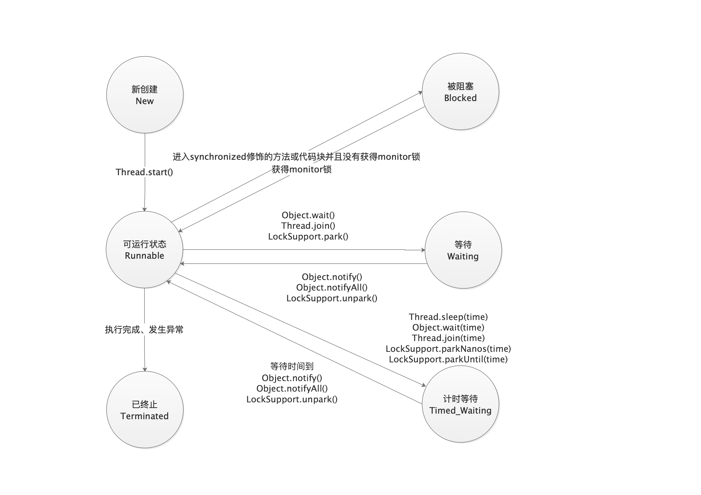

#  线程的八大核心基础知识
##  创建线程的方法

- 创建方式
  - 实现Runnable接口
  - 继承Thread类

- 实现Runnable接口好在哪里？ 继承Thread类是不推荐的，因为它有以下的一些缺点：  

  - 从代码架构角度：具体的任务（run方法）应该和“创建和运行线程的机制（Thread类）”解耦，用runnable对象可以实现解耦。
  -  使用继承Thread的方式的话，那么每次想新建一个任务，只能新建一个独立的线程，而这样做的损耗会比较大（比如重头开始创建一个线程、执行完毕以后再销毁等。如果线程的实际工作内容，也就是run()函数里只是简单的打印一行文字的话，那么可能线程的实际工作内容还不如损耗来的大）。如果使用Runnable和线程池，就可以大大减小这样的损耗。
  -  继承Thread类以后，由于Java语言不支持双继承，这样就无法再继承其他的类，限制了可扩展性。 通常我们优先选择方法1

- 两种方法的本质对比 

  - 方法一和方法二，也就是“实现Runnable接口并传入Thread类”和“继承Thread类然后重写run()”在实现多线程的本质上，并没有区别，都是最终调用了start()方法来新建线程。

  - 这两个方法的最主要区别在于run()方法的内容来源： 

    ```java
     @Override public void run() {     
         if (target != null) {         
             target.run();     
         } 
     } 
    ```

    

  - 方法一：最终调用target.run(); 

  - 方法二：run()整个都被重写

- 两种方式同时使用会出现什么结果

  ```java
  package threadcoreknowledge.createthreads;
  
  /**
   * 同时使用两种方式
   */
  public class BothRunnableThread {
  
      public static void main(String[] args) {
          new Thread(new Runnable() {
              @Override
              public void run() {
                  System.out.println("我来自Runnable");
              }
          }){
              @Override
              public void run() {
                  System.out.println("我来自Thread");
              }
          }.start();
      }
  }
  
  /**
  	会打印 ==》 我来自Thread
  */
  ```

- 有多少种实现线程的方法？总结回答

   答题思路，以下5点：  

  - 从不同的角度看，会有不同的答案。 

  - 典型答案是两种，分别是实现Runnable接口和继承Thread类，然后具体展开说； 

  - 但是，我们看原理，其实Thread类实现了Runnable接口，并且看Thread类的run方法，会发现其实那两种本质都是一样的，run方法的代码如下：

  ```java
   @Override public void run() {     
       if (target != null) {         
           target.run();     
       } 
   } 
  ```

  

  - 方法一和方法二，

    也就是“继承Thread类然后重写run()”和“实现Runnable接口并传入Thread类”在实现多线程的本质上，并没有区别，都是最终调用了start()方法来新建线程。这两个方法的最主要区别在于run()方法的内容来源：

    ​	 方法一：最终调用target.run(); 

    ​	 方法二：run()整个都被重写 

  - 然后具体展开说其他方式； 还有其他的实现线程的方法，例如线程池等，它们也能新建线程，但是细看源码，从没有逃出过本质，也就是实现Runnable接口和继承Thread类。 
  -  结论:我们只能通过新建Thread类这一种方式来创建线程，但是类里面的run方法有两种方式来实现，
    - 第一种是重写run方法，
    - 第二种实现Runnable接口的run方法，然后再把该runnable实例传给Thread类。除此之外，从表面上看线程池、定时器等工具类也可以创建线程，但是它们的本质都逃不出刚才所说的范围。  以上这种描述比直接回答一种、两种、多种都更准确。

## 启动线程的正确方式

- start()和run()

- start源码

  ```java
   public synchronized void start() {
          /**
           * This method is not invoked for the main method thread or "system"
           * group threads created/set up by the VM. Any new functionality added
           * to this method in the future may have to also be added to the VM.
           *
           * A zero status value corresponds to state "NEW".
           */
       	// 进行状态的判断 NEW 状态才可以启动
          if (threadStatus != 0)
              throw new IllegalThreadStateException();
  
          /* Notify the group that this thread is about to be started
           * so that it can be added to the group's list of threads
           * and the group's unstarted count can be decremented. */
          // 加入线程组
          group.add(this);
  
          boolean started = false;
          try {
              // 执行start0方法
              start0();
              started = true;
          } finally {
              try {
                  if (!started) {
                      group.threadStartFailed(this);
                  }
              } catch (Throwable ignore) {
                  /* do nothing. If start0 threw a Throwable then
                    it will be passed up the call stack */
              }
          }
      }
  ```

- 两次执行start 会抛出异常，因为start方法会判断线程的状态是否为NEW状态

- start 最终会调用run方法，为什么还要调用start方法，因为run方法是一个普通方法，只有start方法才会进行线程的准备工作，启动子线程调用run方法执行需要的任务

## 停止线程的方式

**使用interrupt来通知，而不是强制停止**

### 停止的方式

- 通常情况下如何停止

  ```java
  package threadcoreknowledge.stopthreads;
  
  /**
   * run 方法内没有sleep和wait方法下停止线程
   */
  public class RightWayStopThreadWithoutSleep implements Runnable{
  
  
      @Override
      public void run() {
          int num = 0;
          while (!Thread.currentThread().isInterrupted() && num < Integer.MAX_VALUE/2) {
              if (num % 10000 == 0) {
                  System.out.println(num + "是10000的倍数");
              }
              num++;
          }
          System.out.println("线程执行结束");
      }
  
      public static void main(String[] args) throws InterruptedException {
          Thread thread = new Thread(new RightWayStopThreadWithoutSleep());
          thread.start();
          Thread.sleep(2000);
          thread.interrupt();
      }
  }
  ```

  

- 线程被阻塞如何停止

  ```java
  package threadcoreknowledge.stopthreads;
  
  /**
   *  带有sleep的中断线程的方法
   */
  public class RightWayStopThreadWithSleep{
  
  
      public static void main(String[] args) throws InterruptedException {
  
          Runnable runnable = () ->{
              int num = 0;
              while (num <=300 && !Thread.currentThread().isInterrupted()) {
                  if (num % 100 ==0) {
                      System.out.println(num + "是100的倍数");
                  }
                  num++;
              }
  
              try {
                  Thread.sleep(1000); // 睡眠过程中，如果收到停止信号，则会抛出异常java.lang.InterruptedException: sleep interrupted
              } catch (InterruptedException e) {
                  e.printStackTrace();
              }
              System.out.println("任务执行结束了！");
          };
  
          Thread thread = new Thread(runnable);
          thread.start();
          Thread.sleep(500);
          thread.interrupt();
  
      }
  }
  
  ```

  

- 每次迭代之后都阻塞如何停止

  ```java
  package threadcoreknowledge.stopthreads;
  
  /**
   * 每次循环都sleep或wait等待的情况下停止线程
   */
  public class RightWayStopThreadWithSleepEveyLoop {
  
      public static void main(String[] args) throws InterruptedException {
          Runnable runnable = ()->{
              int num = 0;
              try {
                  while (num <=10000 /*&& !Thread.currentThread().isInterrupted()*/){ // 此处不需要每次都判断是否中断
                      if (num % 100 == 0) {
                          System.out.println(num + "是100倍数");
                      }
                      num++;
                      Thread.sleep(10);
                  }
              } catch (InterruptedException e) {
                  e.printStackTrace();
              }
          };
        	// 如果try catch 在while 循环里面 intertupt 是没有生效的
          /**while (num <= 10000 && !Thread.currentThread().isInterrupted()) {
            if (num % 100 == 0) {
              System.out.println(num + "是100的倍数");
            }
  
            num++;
            // try catch 在while的内部线程不会中断
            try {
            	// sleep 会清除interrupt的标记位，如果try catch 的话当前线程的停止标志就会被清除
              Thread.sleep(10);
            } catch (InterruptedException e) {
              e.printStackTrace();
            }
          }*/
  
          Thread thread = new Thread(runnable);
          thread.start();
          Thread.sleep(5000);
          thread.interrupt();
      }
  }
  
  ```

- 最佳实践

  - 优选选择：传递中断

    ```java
    package threadcoreknowledge.stopthreads;
    
    /**
     * catch住InterruptedException优选选择抛出，那么在run方法就会强制try catch
     */
    public class RightWayStopThreadInProd implements Runnable{
    
    
        @Override
        public void run() {
            try {
                while (true){
                    System.out.println("go");
                    throwInMethod();
                }
            } catch (InterruptedException e) {
                System.out.println("保存日志");
                e.printStackTrace();
            }
        }
    
        /**
         * 抛出异常 不要tryCatch 如果tryCatch就达不到停止的效果
         * @throws InterruptedException
         */
        private void throwInMethod() throws InterruptedException {
            Thread.sleep(2000);
            /*try {
                Thread.sleep(2000);
            } catch (InterruptedException e) {
                e.printStackTrace();
            }*/
        }
    
        public static void main(String[] args) throws InterruptedException {
            Thread thread = new Thread(new RightWayStopThreadInProd());
            thread.start();
            Thread.sleep(1000);
            thread.interrupt();
        }
    }
    
    ```

    

  - 不想或无法传递：**恢复中断**

    ```java
    package threadcoreknowledge.stopthreads;
    
    /**
     * catch住InterruptedException后调用Thread.currentThread().interrupt()来
     */
    public class RightWayStopThreadInProd2 implements Runnable{
    
    
        @Override
        public void run() {
            while (true){
                if (Thread.currentThread().isInterrupted()){
                    System.out.println("Interrupt 线程被中断了");
                    break;
                }
                System.out.println("go");
                reInterrupt();
            }
        }
    
        /**
         * 如果一定要catch 那么在catch后面再继续中断线程
         * @throws InterruptedException
         */
        private void reInterrupt() {
            try {
                Thread.sleep(2000);
            } catch (InterruptedException e) {
                Thread.currentThread().interrupt(); // 继续中断异常
                e.printStackTrace();
            }
        }
    
        public static void main(String[] args) throws InterruptedException {
            Thread thread = new Thread(new RightWayStopThreadInProd2());
            thread.start();
            Thread.sleep(1000);
            thread.interrupt();
        }
    }
    
    ```

    

  - 不应屏蔽中断

    - 如果屏蔽中断会产生信息不畅通

- 响应中断的方式

  - Object类的 wait()、wait(long) 、wait(long,int)
  - Thread.sleep(long)/sleep(long,int)
  - Thread.join()/join(long)/join(long,int)
  - java.util.concurrent.BlockingQueue.take()/put(E)
  - java.util.concurrent.locks.Lock.lockInterruptibly()
  - java.util.concurrent.CountDownLatch.await()
  - java.util.concurrent.CyclicBarrier.await()
  - java.util.concurrent.Exchanger.exchange(V)
  - java.nio.channels.InterruptibleChannel相关方法
  - java.nio.channels.Selector的相关方法


### 错误停止的方法

#### 第一种方式，编译器会给出提示

- stop
  - 可能导致数据错乱，但是会释放monitor锁
- suspend
  - 不会释放锁，带着锁挂起，可能会导致死锁
- resume
  - 不会释放锁，带着锁挂起，可能会导致死锁

#### 第二种方式，需要注意

- 用volatile 设置boolean的标记位

  - 看上去可行

  - 错误原因

    为什么用volatile停止线程不够全面 

    ​		解答：这种做法是错误的，或者说是不够全面的，在某些情况下虽然可用，但是某些情况下有严重问题。 这种方法在《Java并发编程实战》中被明确指出了缺陷，我们一起来看看缺陷在哪里： 此方法错误的原因在于，如果我们遇到了线程长时间阻塞（这是一种很常见的情况，例如生产者消费者模式中就存在这样的情况），就没办法及时唤醒它，或者永远都无法唤醒该线程，而interrupt设计之初就是把wait等长期阻塞作为一种特殊情况考虑在内了，我们应该用interrupt思维来停止线程。

  - 修正方式

    - 使用interrupt

### 停止线程相关函数解析

#### interrupt

- 如何分析native方法 去看openjdk源码


#### 判断是否已中断的方法

- static boolean interrupted()

  - 监测当前线程是否被中断 true 中断 false 没有中断，返回之后将线程中断状态设置为false，那么需要自己进行处理，抛出异常或再次执行interrupted中断

- boolean isInterrupted()

  - 监测当前线程是否被中断

- Thread.intertupted()目标对象

  - 是当前调用的线程

    ```java
    package threadcoreknowledge.stopthreads;
    
    public class RightWayInterrupted {
    
        public static void main(String[] args) throws InterruptedException {
            Thread threadOne = new Thread(new Runnable() {
                @Override
                public void run() {
                    for (; ; ) {
    
                    }
                }
            });
    
            threadOne.start();
            threadOne.interrupt();// 发送中断信号
    
            System.out.println("IsInterrupted:" + threadOne.isInterrupted());
            System.out.println("IsInterrupted:" + threadOne.interrupted());
            System.out.println("IsInterrupted:" + Thread.interrupted());
            System.out.println("IsInterrupted:" + threadOne.isInterrupted());
            threadOne.join();
            System.out.println("main thread is over ");
    
        }
    }
    
    /**
    	输出结果
    	IsInterrupted:true
        IsInterrupted:false
        IsInterrupted:false
        IsInterrupted:true
    */
    ```

### 面试问题

- 如何停止线程

  >1.采用interrupt来请求，好处可以保证数据安全，要把中断的权利交给被中断线程
  >
  >2.想要停止线程，要请求方、被请求方、子方法被调用方互相配合
  >
  >​	发出停止请求
  >
  >   被停止方法需要处理终端信号
  >
  >   如果是run方法调用了其他方法，需要向上抛出异常
  >
  >3.最后说错误的方法
  >
  >​	stop和suspend被弃用，volatile的boolean方式无法处理长时间阻塞的情况

- 如何处理不可中断的阻塞

  >如果线程阻塞是由于调用了 wait()，sleep() 或 join() 方法，你可以中断线程，通过抛出 InterruptedException 异常来唤醒该线程。
  >
  > 但是对于不能响应InterruptedException的阻塞，很遗憾，并没有一个通用的解决方案。 但是我们可以利用特定的其它的可以响应中断的方法，比如ReentrantLock.lockInterruptibly()，比如关闭套接字使线程立即返回等方法来达到目的。 答案有很多种，因为有很多原因会造成线程阻塞，所以针对不同情况，唤起的方法也不同

## 线程的生命周期

### 线程的6种状态

- New : 以创建但未启动 new Thread() 未调用start()
- Runnable：调用start()方法后就会进入Runnable，对于操作系统中的read和running
- Blocked：当线程进入synchronized修饰的代码，并且该锁被其他线程拿走了
- Waiting：调用以下方法Object.wait()、Thread.join()、LockSupport.park()方法
- Timed Waiting：调用以下方法Object(time)、Thread.sleep(time)、Thread.join(time)、LockSupport.parkNanos(time)、LockSupport.parkUnitil(time)
- Terminated：线程执行完成、出现了一个没有被捕获的异常

### 每个状态的含义

```java
package threadcoreknowledge.sixstates;

/**
 * 展示线程的New Runnable Terminated，即时是正在运行也是Runnable状态
 */
public class NewRunnableTerminated implements Runnable{


    public static void main(String[] args) {
        NewRunnableTerminated r = new NewRunnableTerminated();
        Thread thread = new Thread(r);
        System.out.println(thread.getState()); // New状态
        thread.start();
        System.out.println(thread.getState()); // Runnable
        try {
            Thread.sleep(10);
        } catch (InterruptedException e) {
            e.printStackTrace();
        }
        System.out.println(thread.getState()); // Runnable

        try {
            Thread.sleep(1000);
        } catch (InterruptedException e) {
            e.printStackTrace();
        }
        System.out.println(thread.getState());
    }

    @Override
    public void run() {
        for (int i = 0; i < 1000; i++) {
            System.out.println(i);
        }
    }
}

```


```java
package threadcoreknowledge.sixstates;

/**
 * 展示 Blocked Waiting Timed_Waiting
 */
public class BlockedWaitingTimedWaiting implements Runnable{


    public static void main(String[] args) {
        BlockedWaitingTimedWaiting r = new BlockedWaitingTimedWaiting();
        Thread t1 = new Thread(r);
        Thread t2 = new Thread(r);

        t1.start();
        try {
            Thread.sleep(1000);
        } catch (InterruptedException e) {
            e.printStackTrace();
        }
        t2.start();
        // 打印TIMED_WAITING 因为在sleep中
        System.out.println(t1.getState());
        // 打印BLOCKED 因为没有拿到monitor锁
        System.out.println(t2.getState());

        try {
            Thread.sleep(2300);
        } catch (InterruptedException e) {
            e.printStackTrace();
        }
        System.out.println(t1.getState());


    }

    @Override
    public void run() {
        try {
            syn();
        } catch (InterruptedException e) {
            e.printStackTrace();
        }
    }

    private synchronized void syn() throws InterruptedException {
        Thread.sleep(2000);
        wait();
    }
}

```


### 状态的转化图示




### 阻塞状态是什么

**一般习惯把Blocked、Waiting、Timed_waiting 都称之为阻塞状态**

### 面试问题

- 线程有几种状态，线程的生命周期

## Thread和Object中重要的方法

### 重要方法概览

| 类     | 方法名                    | 简介                   |
| ------ | ------------------------- | ---------------------- |
| Thread | sleep相关                 | 线程进入休眠           |
|        | join                      | 等待其他线程执行完毕   |
|        | yield相关                 | 放弃获取到的CPU资源    |
|        | currentThread             | 获取当前执行线程的引用 |
|        | start,run相关             | 启动线程相关           |
|        | interrupt相关             | 中断线程               |
|        | stop、suspend、resume相关 | 已废弃                 |
| Object | wait/notify/notifyAll     | 线程休息或唤醒         |


### wait、notify、notifyAll方法详解

- 作用、用法

  - 阻塞阶段
    - 必须先拥有对象的monitor锁
    - 线程调用wait方法阻塞后，只有以下四种情况会被唤醒
      - 另一个线程调用monitor锁的notify方法，且刚好被唤醒的是本线程
      - 另外一个线程调用monitor锁的notifyAll方法
      - wait设置了超时时间，时间到了就会唤醒，如果传入0就进入了永久等待
      - 线程自身调用了interrupt
  - 唤醒阶段
    - notify唤醒单个正在等待的线程，这个是随机的，多个等待时随机选择，在synchronized内部使用
    - notifyAll 唤醒所有等待的线程，在synchronized内部使用
  - 遇到中断
    - wait 方法之后中断会抛出InterruptException 释放monitor锁

- 代码演示

  - 普通用法

    ```java
    package threadcoreknowledge.threadobjectcommonmethods;
    
    /**
     * wait和 notify 的基本用法
     *  代码执行顺序
     *  证明wait 释放了锁
     */
    public class Wait {
    
        public static Object object = new Object();
    
        public static void main(String[] args) throws InterruptedException {
            Thread1 t1 = new Thread1();
            Thread2 t2 = new Thread2();
            t1.start();
            Thread.sleep(200);
            t2.start();
    
    
        }
    
        static class Thread1 extends Thread {
    
            @Override
            public void run() {
                synchronized (object) {
                    System.out.println("线程"+ Thread.currentThread().getName()+"开始执行");
                    try {
                        object.wait(); //释放了锁
                    } catch (InterruptedException e) {
                        e.printStackTrace();
                    }
    
                    System.out.println("线程" + Thread.currentThread().getName()+"获取到了锁");
                }
            }
    
        }
    
        static class Thread2 extends Thread {
            @Override
            public void run() {
                synchronized (object) {
                    object.notify(); // 虽然唤醒了但是还是没有释放锁，知道synchronized结束
                    System.out.println("线程" + Thread.currentThread().getName()+ "调用了notify");
                }
            }
        }
    }
    
    ```

  - notify 和notifyAll

    ```java
    package threadcoreknowledge.threadobjectcommonmethods;
    
    /**
     * 3个线程，线程1 和线程2 被阻塞，线程3唤醒他们，notify 和 notifyAll 唤醒他们
     *
     */
    public class WaitNotifyNotifyAll implements Runnable{
    
        private static final Object resourceA = new Object();
    
        public static void main(String[] args) {
            WaitNotifyNotifyAll r = new WaitNotifyNotifyAll();
            Thread t1 = new Thread(r);
            Thread t2 = new Thread(r);
            Thread t3 = new Thread(() -> {
                synchronized (resourceA) {
                    resourceA.notifyAll(); // 此处如果是notify则只能唤醒一个线程
                    System.out.println(Thread.currentThread().getName() + " notified");
                }
            });
            t1.start();
            t2.start();
            try {
                Thread.sleep(200);
            } catch (InterruptedException e) {
                e.printStackTrace();
            }
            t3.start();
        }
    
        @Override
        public void run() {
    
            synchronized (resourceA) {
                System.out.println(Thread.currentThread().getName() + " got resourceA lock");
    
                try {
                    System.out.println(Thread.currentThread().getName() +" waits to start, release lock ");
                    resourceA.wait();
                    System.out.println(Thread.currentThread().getName() +" is waiting to end");
                } catch (InterruptedException e) {
                    e.printStackTrace();
                }
    
            }
    
        }
    }
    
    ```

  - 锁之间是独立的

    ```java
    package threadcoreknowledge.threadobjectcommonmethods;
    
    /**
     * 证明wait只释放当前的那把锁
     */
    public class WaitNotifyReleaseOwnMonitor {
    
    
        private static volatile Object resouceA = new Object();
        private static volatile Object resouceB = new Object();
    
        public static void main(String[] args) {
            Thread t1 = new Thread(() -> {
                synchronized (resouceA) {
                    System.out.println(Thread.currentThread().getName() + " got resourceA lock ");
                    synchronized (resouceB) {
                        System.out.println(Thread.currentThread().getName() + " got resourceB lock ");
                        try {
                            System.out.println(Thread.currentThread().getName() + " releases resourceA lock ");
                            resouceA.wait();
                        } catch (InterruptedException e) {
                            e.printStackTrace();
                        }
                    }
                }
    
            });
    
            Thread t2 = new Thread(() -> {
                try {
                    Thread.sleep(1000);
                } catch (InterruptedException e) {
                    e.printStackTrace();
                }
                synchronized (resouceA) {
                    System.out.println(Thread.currentThread().getName() + " got resourceA lock. ");
                    System.out.println(Thread.currentThread().getName() + " try got resourceA lock. ");
                    synchronized (resouceB) {
                        System.out.println(Thread.currentThread().getName() + " got resourceB lock. ");
                    }
                }
            });
    
            t1.start();
            t2.start();
        }
    }
    
    ```

    

- 特点和性质

  - 必须先拥有monitor
  - 只能唤醒其中一个
  - 属于Object类
  - 类似功能 Condition，jdk的阻塞队列使用了Condition

- 原理

  - 多个线程同时进行锁的抢占
  - 其中一个获取到锁进入线程执行，执行过程中如果调用了wait方法就会释放锁
  - 释放锁之后进入等待状态，其他线程开始获取锁，继续执行

- 实现生产者和消费者模式

  - 使用wait和notify实现

    ```java
    package threadcoreknowledge.threadobjectcommonmethods;
    
    import java.util.Date;
    import java.util.LinkedList;
    
    /**
     * 用 notify /wait 方式实现 不用阻塞队列
     */
    public class ProducerConsumerModel {
    
    
        public static void main(String[] args) {
            EventStorage eventStorage = new EventStorage();
            Producer producer = new Producer(eventStorage);
            Consumer consumer = new Consumer(eventStorage);
            new Thread(producer).start();
            new Thread(consumer).start();
        }
    }
    
    
    class Producer implements Runnable{
    
        private EventStorage storage;
    
        public Producer(EventStorage storage) {
            this.storage = storage;
        }
    
        @Override
        public void run() {
            for (int i = 0; i < 100; i++) {
    
                storage.put();
            }
        }
    }
    
    class Consumer implements Runnable{
    
        private EventStorage storage;
    
        public Consumer(EventStorage storage) {
            this.storage = storage;
        }
    
        @Override
        public void run() {
            for (int i = 0; i < 100; i++) {
                storage.take();
            }
        }
    }
    
    
    class EventStorage{
        private int maxSize;
        private LinkedList<Date> storage;
    
        public EventStorage(){
            maxSize = 10;
            storage = new LinkedList<>();
        }
    
        public synchronized void put(){
            while (storage.size() == maxSize) {
                try {
                    wait();
                } catch (InterruptedException e) {
                    e.printStackTrace();
                }
            }
            storage.add(new Date());
            System.out.println("仓库里有了" + storage.size() + "个产品");
            notify();
    
        }
    
        public synchronized void take(){
            while (storage.size() == 0) {
                try {
                    wait();
                } catch (InterruptedException e) {
                    e.printStackTrace();
                }
            }
            System.out.println("拿到了" + storage.poll() + "，仓库的还剩下" + storage.size());
            notify();
        }
    }
    
    
    
    ```

    

- 注意点
  - 当线程调用了wait方法释放了锁，但是刚刚被唤醒的时候，不一定能立即拿到锁，notify的线程可能还持有锁，此时线程会进入blocked状态
  - 如果在等待过程中发生异常，线程直接进入Terminated状态
- 常见面试问题
  
  - 用程序实现交替打印0-100的奇偶数
  
    - 使用synchronized实现，会造成资源的浪费
  
      ```java
      package threadcoreknowledge.threadobjectcommonmethods;
      
      /**
       * 使用synchronized 实现交替打印0-100的奇偶数，效率比较低下
       */
      public class WaitNotifyPrintOddEvenSyn {
      
          // 新建两个线程
          // 一个处理偶数，一个处理奇数(用位运算)
          private static int count;
          private static final Object lock = new Object();
      
          public static void main(String[] args) {
              Thread enveThread = new Thread(new Runnable() {
                  @Override
                  public void run() {
      
                      while (count < 100) {
                          synchronized (lock) {
                              if ((count&1) == 0) { // 速度更快
                                  System.out.println(Thread.currentThread().getName() + "：" + count);
                                  count++;
                              }
      
                          }
                      }
                  }
              },"偶数");
      
              Thread oddThread = new Thread(new Runnable() {
                  @Override
                  public void run() {
      
                      while (count < 100) {
                          synchronized (lock) {
                              if ((count&1) != 0) { // 速度更快
                                  System.out.println(Thread.currentThread().getName() + "：" + count);
                                  count++;
                              }
                          }
                      }
                  }
              },"奇数");
      
              enveThread.start();
              oddThread.start();
          }
      
      
      }
      
      ```
  
    - 使用wait 和 notify实现
  
      ```java
      package threadcoreknowledge.threadobjectcommonmethods;
      
      /**
       * 使用wait 和notify
       * 1.拿到锁就打印
       * 2.打印完唤醒其他线程，自己wait
       */
      public class WaitNotifyPrintOddEvenWait {
      
          private static int count = 0;
          private static final Object lock = new Object();
      
          public static void main(String[] args) {
      
              Runnable runnable = () -> {
                  while (count <=100 ) {
                      synchronized (lock) {
                          System.out.println(Thread.currentThread().getName() + ":" + count++);
                          lock.notify();
                          try {
                              if (count <=100) {
                                  lock.wait();
                              }
                          } catch (InterruptedException e) {
                              e.printStackTrace();
                          }
                      }
                  }
              };
      
              Thread t1 = new Thread(runnable);
              Thread t2 = new Thread(runnable);
              t1.start();
              t2.start();
      
          }
      }
      
      ```
  
    - 手写生产者和消费者模式
  
    - wait 为什么需要在synchronized代码块中使用，而sleep则不需要
  
      - 为了防止了死锁，wait释放掉了monitor锁
      - sleep只是针对自己的线程，不会设计到多个线程
  
    - wait 和 notify 定义在Object类里，而sleep定义在Thread里面
  
      - wait和notify 是锁级别操作，而锁是绑定到对象的，如果定义在Thread中，就会造成局限性，如果一个线程持有多个锁，需要锁之间需要配合
  
    - wait属于Object ,如果调用Thread.wait会怎么样
  
      - Thread 退出的时候自动notify
  
    - notify和notifyAll如何抉择
  
      - 是唤醒单个还是多个线程
  
    - notifyAll会唤醒所有的线程，但只有一个成功，失败的怎么样
  
      - 会进入等待

### sleep方法详解

#### 作用

- 我只想让线程在预期的时间执行，其他时候不要占用CPU资源

#### 特点

- 不释放锁
  
  - 包含synchronized和lock
  
- 响应中断
  
  - sleep期间会检查中断状态，如果中断，则抛出 InterruptedException 清空中断状态
  
  >sleep方法会让线程进入Timed_waiting状态，并且不占用CPU资源，但是不会释放锁，直到规定时间后再继续执行，休眠的过程中如果被中断，会抛出异常并清除中断状态

- 常见面试问题
  - wait/notify、sleep的异同
    - 相同
      - wait 和 sleep方法都可以是线程阻塞，对应的线程状态位waiting和Timed_waiting
      - wait 和 sleep 方法都可以响应中断
    - 不同
      - wait 方法的执行必须在同步方法中进行，而sleep不需要
      - 同步方法里执行sleep方法时，不会释放monitor，但是wait会释放monitor锁
      - sleep方法短暂休眠之后会主动退出阻塞，而没有制定时间的wait方法则需要被其他线程中断后才能退出阻塞
      - wait和notify、notfiyAll时Object方法，而sleep时Thread 的方法

### join方法详解

- 作用

  - 因为新的线程加入了我们，我们需要等他执行完再出发

- 用法

  - main等待thread1执行完毕，注意谁等谁

- 三个例子

  等待资源加载完成

  - 普通用法

    ```java
    package threadcoreknowledge.threadobjectcommonmethods;
    
    import java.util.concurrent.TimeUnit;
    
    /**
     * 演示join ，注意语句的输出顺序
     */
    public class Join {
        public static void main(String[] args) throws InterruptedException {
    
    
            Runnable r = () ->{
                try {
                    TimeUnit.SECONDS.sleep(1);
                } catch (InterruptedException e) {
                    e.printStackTrace();
                }
                System.out.println(Thread.currentThread().getName() + "执行完毕");
            };
    
            Thread t1 = new Thread(r);
            Thread t2 = new Thread(r);
            t1.start();
            t2.start();
            System.out.println("开始等待子线程运行完毕");
            t1.join();
            t2.join();
            System.out.println("所有线程执行完毕");
        }
    }
    
    ```

  - 遇到中断

    ```java
    package threadcoreknowledge.threadobjectcommonmethods;
    
    import java.util.concurrent.TimeUnit;
    
    /**
     * 等待的是主线程，主线程interrupt
     */
    public class JoinInterrupt {
        public static void main(String[] args) {
            Thread mainThread = Thread.currentThread();
            Runnable r = () -> {
                try {
                    mainThread.interrupt();
                    TimeUnit.SECONDS.sleep(1);
                    System.out.println(Thread.currentThread().getName() + "finish!");
                } catch (InterruptedException e) {
                    System.out.println("子线程被中断了");
                }
            };
    
            Thread thread = new Thread(r);
            thread.start();
            System.out.println("等待子线程运行完毕");
    
            try {
                thread.join();
            } catch (InterruptedException e) {
                System.out.println(Thread.currentThread().getName() + "中断了");
                thread.interrupt();
            }
            System.out.println("子线程已运行完成");
        }
    }
    ```

  - join时线程的状态，等待线程为Waiting状态

    ```java
    package threadcoreknowledge.threadobjectcommonmethods;
    
    
    
    /**
     * 先join 再main线程的状态
     */
    public class JoinThreadState {
    
        public static void main(String[] args) throws InterruptedException {
            Thread mainThread = Thread.currentThread();
            Thread thread = new Thread(new Runnable() {
                @Override
                public void run() {
                    try {
                        Thread.sleep(3000);
                        System.out.println(mainThread.getState());
                        System.out.println(Thread.currentThread().getName() + "子线程执行完毕了");
                    } catch (InterruptedException e) {
                        e.printStackTrace();
                    }
                }
            });
            thread.start();
            System.out.println("等待子线程执行完毕");
            thread.join();
            System.out.println("子线程运行完毕");
    
    
        }
    }
    
    ```

    

- CountDownLatch 和 CyclicBarrier类的使用

  - 

- 原理

  - join底层使用了wait但是没有notify的方法

  - 因为Thread.run 方法执行完会执行ensure_join 唤醒，所以不建议采用Thread为lock

  - 等价代码

    ```java
    synchronized (t1) {
      t1.wait();
    }
    ```

- 常见面试问题

  - join期间，线程处于哪种线程状态
    - 等待的线程处于waiting状态

### yield方法详解

- 作用
  - 释放我的CPU时间片，但是线程还是Runnable状态，持有锁，不会阻塞
- 定位
  - JVM不保证遵循
- yield和sleep区别
  - sleep 会进入阻塞状态，但是yield还是处于Runnable状态

### Thread.currentThread()方法详解

### start 和 run 方法

- run只是普通方法
- start方法时线程启动的方法

### stop、suspend、resume方法

- 弃用


### 面试问题

- 为什么线程通信的方法wait()、notify()和notifyAll()被定义在Object类，而sleep定义在Thread类里
- 用3种方法实现生产者模式
- JavaSE8 和java1.8和JDK8是什么关系，是同一东西吗？
- Join 和 sleep 和 wait期间线程的状态分别是什么，为什么？


## 线程各种属性

### 属性纵览

| 属性名称                 | 用途                                                         |
| ------------------------ | ------------------------------------------------------------ |
| 编号（ID）               | 每一个线程有自己的ID，用于标示不同的线程                     |
| 名称（Name）             | 作用让用户或程序员在开发，调试，运行过程中，更容易区分每个不同的线程，定位问题 |
| 是否是守护线程(isDaemon) | true代表是守护线程，false代表线程是非守护线程，就是用户线程  |
| 优先级(Priority)         | 优先级这个属性的目的是告诉线程调度器，用户希望哪些线程相对多运行，哪些线程少运行 |

### 线程id

自增的，初始化为0 ，但是里面是使用++i操作，所以是1开始的

### 线程的名字

- 默认线程名字的源码分析
- 如何修改线程的名字


### 守护线程


### 线程的优先级


### 总结属性


### 常见面试问题

- 什么时候需要设置守护线程
- 我们如何利用程序优先级来帮助程序运行，有哪些禁忌
- 不同的操作系统如果处理优先级问题

## 未捕获异常如何处理


### 常见面试问题


## 线程会产生的问题


